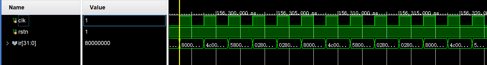
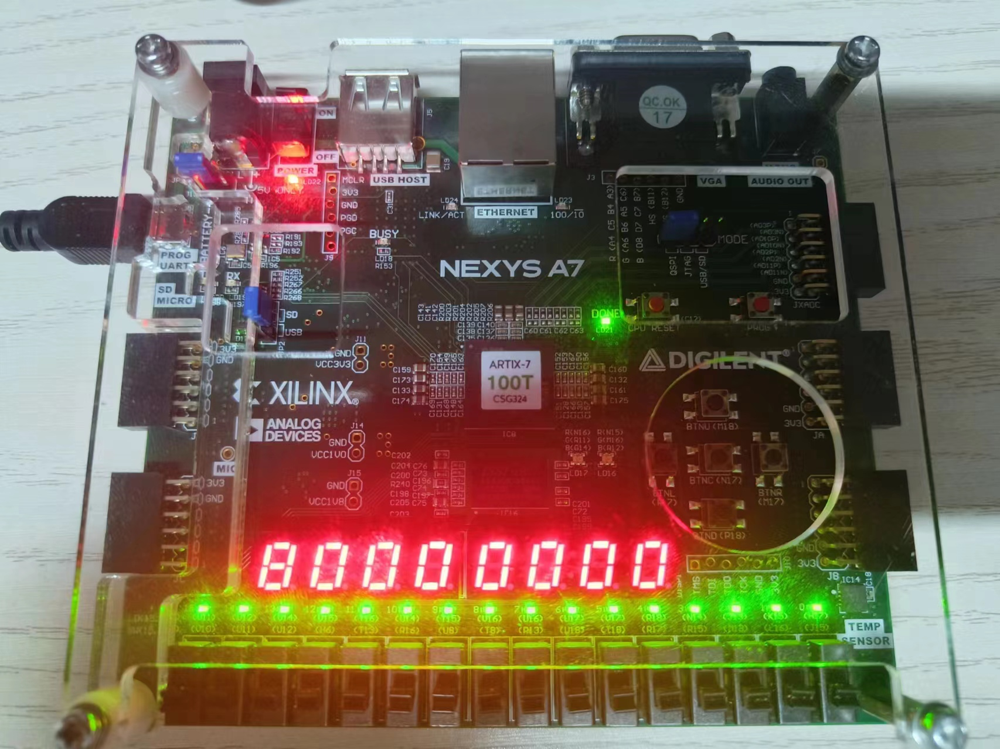
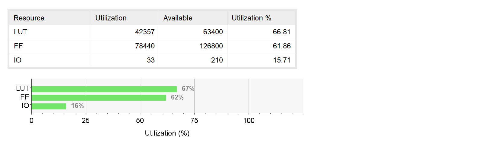

# <center>LabH5 - Cache设计

<center>PB22081571 薄震宇

[TOC]

## 实验目的

在流水线CPU的基础上，增加指令Cache，以利用局部性原理加快CPU运行速度。在设计的过程中，掌握Cache的工作原理，基本结构，设计和调试方法，同时掌握数据通路和控制器的设计和描述方法。

## 实验内容

1. 增加指令Cache的存储区域。
2. 实现指令的读取方法——先尝试从Cache中读取，若命中则返回，若未命中则前往主存中读取。
3. 实现Cache的2路组相连映射。
4. 实现Cache的`LRU`替换算法。
5. 将Cache适配到已实现的流水线CPU上，需要增加Cache和流水线CPU的握手信号，为流水线CPU增加控制信号以处理还未取到指令的情况。

## 实验原理

### 数据通路

本次实验我主要根据马子睿助教提供的数据通路，如下：


各个部件的功能如下：

* `Request Buffer`：存储访存的地址 ，用以后续比较和写操作
* `Return Buffer`：移位寄存器 ，逐个拼接从主 存 返 回 的 32个数据成一个Cache行
* `Data Memory`：Cache的数据存储部件
* `TagV Memory`：Cache的`tag`存储部件
* `Read Manage`：读取从Cache获得的指令
* `LRU`：实现未命中时Cache的替换
* `FSM`：有限状态机，发出各种控制信号

在具体设计时，我的`Data Memory`和`TagV Memory`的数据位宽和深度与图中并不一致：我的数据位宽为4个字，深度为256，即我的Cache的存储分为256个`Cache Set`，每个`Cache Set`有两个`Cache Line`，每个`Cache Line`有4个字。所以我对传给Cache的地址的解析方式如下：

```verilog
localparam DATA_WIDTH = 128;
localparam TAG_WIDTH  = 20;
localparam ADDR_WIDTH = 8;
localparam MEM_SIZE   = 256;
assign tag      = raddr[31:ADDR_WIDTH+4];// 默认为31:12
assign r_index  = raddr[ADDR_WIDTH+3: 4];// 默认为11:4
assign offset   = raddr[ 3: 2];
```

### 有限状态机

#### 状态机设置

当前状态：`current_state`

下一状态：`next_state`

`LOOKUP`：根据CPU发送的地址寻找指令，若命中，则`next_state = LOOKUP`，准备接受下一条地址，读取指令；若为命中`next_state = MISS`，前往主存读取地址。

`MISS`：读取来自主存的指令并拼接在`Return buffer`中，当`inst_mem_raddr`（Cache与主存的接口）等于`Return buffer`锁存的地址`addr`时，更新`inst_from_retbuf`。在MISS状态，每个时钟周期的上升沿都令`inst_mem_raddr`自增1，当读取完4个字即`inst_mem_raddr == {2'b00,addr[31:4],2b11}`时置`i_rlast`为1，`next_state  = REFILL`，未读取完时`next_state = MISS`，持续读取拼接。

`REFILL`：这一阶段实现Cache的替换，并将`data_from_mem`置为0（标志着要将`inst_from_retbuf`赋值给`rdata`传给CPU），将`inst_valid`置为1（与CPU的握手信号，表示指令有效）。

#### 控制信号的发出

Cache中所需要的大部分控制信号均由有限状态机发出：

* `miss`：标志着LOOKUP阶段未命中，当`current_state == LOOKUP`且`hit == 0`时赋值为真（hit是一个2位宽的变量，分别标志着两个`Cache Line`的命中情况，在后面介绍`LRU`算法时会详细解释）。
* `addr_ready`：与CPU的握手信号，标志着准备好接受来自CPU的地址，在`current_state == LOOKUP`时，赋值为`resetn`（因为`resetn`为真时Cache才能运行），在其他状态赋值为0，不接受CPU的地址。
* `retbuf_we`：`Return Buffer`的写使能，在`current_state == MISS`时为真，否则为假。
* `i_rlast`：标志着是否完成了对主存读取（读取一个`Cache Line`即4个字），在`current_state == MISS`且`inst_mem_raddr == {2'b00,addr[31:4],2'b11}`时为真。
* `inst_valid`：与CPU的握手信号，标志着读取完成，CPU可以使用通过Cache读取到的指令，在`inst_ready`为真（实现握手）且`LOOKUP`阶段命中或未命中但处于`REFILL`阶段时为真，否则为假。
* `tagv_we`：2位宽，两个`TagV Memory`的写使能，需要在`current_state == REFILL`时赋值，具体赋值在后面的`LRU`算法实现中详细描述。
* `mem_we`：2位宽，`Data Memory`的写使能，与`tagv_we`类似。
* `data_from_mem`：标志着读取的指令来自Cache的`Data Memory`而不是`Return buffer`，在`current_state == LOOKUP`且命中时赋值为真。

具体代码实现如下：

```verilog
assign  miss   		= (hit == 2'b0) && (current_state == LOOKUP);
assign  addr_ready  = (current_state == LOOKUP) ? resetn : 0;
assign  retbuf_we   = (current_state == MISS) ? 1 : 0;
assign  i_rlast     = (inst_mem_raddr == {2'b00,addr[31:4],2'b11}) && (current_state == MISS);
assign  inst_valid  = inst_ready && (((current_state == LOOKUP) && !miss) || (current_state == REFILL));
assign  rbuf_we     = miss;
assign  tagv_we[0]  = (current_state == REFILL) &&  recently_used[w_index];
assign  tagv_we[1]  = (current_state == REFILL) && !recently_used[w_index];
assign  mem_we[0]   = (current_state == REFILL) &&  recently_used[w_index];
assign  mem_we[1]   = (current_state == REFILL) && !recently_used[w_index];
assign  data_from_mem = (current_state == LOOKUP) && !miss;
```

### LRU算法实现

这里我使用了一个大的寄存器来实现。寄存器有256位宽，命名为`recently_used`。`recently_used[i] == 0`表示最近使用的是第0路，替换时需要替换第1路；`recently_used[i] == 1`则表示最近使用的是第1路，替换时需要替换第0路。在`current_state == LOOKUP`并且命中时，修改`recently_used`的值，具体实现为`recently_used[r_index] <= hit[1]`。`hit`是一个2位宽的变量，分别表示`index`对应的两路是否命中，代码实现如下：

```verilog
assign hit[0] = tagv_valid[0] && (r_tag1 == tag);
assign hit[1] = tagv_valid[1] && (r_tag2 == tag);
```

`recently_used`的赋值如下：

```verilog
always @(posedge clk) begin
    if(!resetn)
        recently_used <= 0;
    else if((current_state == LOOKUP) && !miss)
        recently_used[r_index] <= hit[1];
end
```

根据上面的逻辑，可以利用`recently_used`对两路对应的存储器的写使能进行赋值（在`REFIIL`状态进行）,代码如下：

```verilog
assign  tagv_we[0]  = (current_state == REFILL) &&  recently_used[w_index];
assign  tagv_we[1]  = (current_state == REFILL) && !recently_used[w_index];
assign  mem_we[0]   = (current_state == REFILL) &&  recently_used[w_index];
assign  mem_we[1]   = (current_state == REFILL) && !recently_used[w_index];
```

### Cache与CPU的连接

在完成了Cache的设计后，需要将其接入到原先设计的流水线CPU中，主要通过握手信号来完成，此外还需要为CPU增加控制信号以在指令无效时停顿。

#### 握手信号

握手信号有两组，分别与地址和指令相关：

```verilog
wire        inst_valid			// Cache发给CPU，表示地址已准备好
wire        inst_ready			// CPU发给Cache，表示已准备好接收指令
wire        addr_ready			// Cache发给CPU，表示已准备接收地址
wire        addr_valid			// CPU发给Cache，表示地址已准备好
```

其中`inst_ready`赋值为常量1，表示CPU随时准备接收指令；`addr_valid`在`resetn`为真时赋值为`addr_ready`，即一旦Cache准备好接收地址，CPU就可发送，在`resetn`为假时赋值为0，不发送地址。

#### 控制信号的增加

具体来说，只需要在`inst_valid`为假时停顿全流水线（即写使能有效时需要满足`inst_valid`为真）即可，所以只需要为每个段间寄存器都增加写使能信号（原先已经有写使能信号的增加`inst_valid`的控制）：

```verilog
assign pc_we     = ~fStall && inst_valid;
assign IF_ID_we  = ~dStall && inst_valid;
assign ID_EX_we  = ~eStall && inst_valid;
assign EX_MEM_we = inst_valid;
assign MEM_WB_we = inst_valid;
```

## 实验结果

### 仿真结果

由于龙芯提供的Cache的框架过于复杂，且涉及到数据Cache，所以本次实验我换用了群里提供`pico`方案来测试。仿真结果如下：



其中`ir`从CPU输出，赋值为`inst_ram_rdata`。

可以看到经过一段时间后`80000000`循环出现，说明Cache设计正确，流水线CPU接入Cache后正确运行。

### 上板结果

上板我采取的方案是增加了一个数码管显示模块（附文末），显示的数据`output_data`的赋值逻辑如下：

在时钟周期的上升沿进行赋值，`resetn`为假时赋值为0，如果`ir == 32'h8000_0000`，则`output_data`赋值为`32'h8000_0000`，否则`output_data`保持不变。代码如下：

```verilog
reg [31:0] output_data;
always @(posedge clk) begin
    if(!rstn)
        output_data <= 0;
    else if(ir == 32'h8000_0000)
        output_data <= 32'h8000_0000;
    else
        output_data <= output_data;
end
```

同时输出`done`作为检测成功完成的标志：`assign done = (output_data == 32'h8000_0000) ? 16'hffff : 16'h0`。将`done`与LED灯相连，检测成功完成时LED灯全亮。

上板结果如下：



可以看到数码管显示了`80000000`并且LED灯全亮，上板测试正确。

### 电路资源和性能

#### 电路资源

由于块式存储器为同步读取，在读取的下一个周期才能得到结果，所以换用块式存储器需要对原先的流水线CPU做更多的修改，如将`IF`段且切割为2段等，较为复杂，我在修改过程中也是出现了不少问题，最终也没能修改好，只能选择了寄存器堆来作为Cache的存储单元。所以我的电路大量使用了`LUT`(查找表)和`FF`(触发器)，如下图：



图中显示`LUT`(查找表)，`FF`的使用量巨大，这也是符合我的电路设计的。此外`IO`的使用也较多，这也较为正常，因为我最终上板时经过了层层例化，`IO`接口较多。电路图如下：


#### 电路性能

`clk == 10ns`即时钟频率为`100MHz`时，`timing report`如下：


此时`WNS`为负但较小，说明`10ns`已经接近CPU的工作周期。

因为`WNS == -1.411ns`，所以修改`clk`为`11.5ns`，此时时钟频率约为`86.96MHz`，`timing report`如下：


此时WNS已经为正且很小，说明CPU的工作周期约为`11.5ns`，工作频率约为`86.96MHz`。

再将`clk`略微减小至`11ns`，此时时钟频率约为`90.91MHz`，`timing report`如下：


此时WNS为负且很小。

综上可得，CPU的工作周期约为`11.5ns`，工作频率约为`86.96MHz`。未添加Cache的流水线CPU的工作频率约为180MHz，本次实验增加了Cache性能反而下降，猜测应是使用的指令内存还不算很大（我使用的指令内存为32KB，而Cache为8KB），局部性已经较好。并且使用Cache增加了电路的复杂性和延迟，并且刚开始读取指令时也都不会命中，需要到主存中寻找指令，反而增加了时间开销。

## 实验总结

总体来说，尽管实验过程波折较多，但最终顺利完成，并且能正确运行指令测试程序，说明设计的思路与方法均正确。最终得到的增加了Cache的CPU构建而得的SoC的性能反而不如上次实验设计的流水线CPU，在实验环境中应是正常的，在实际应用中增加Cache应当会提升SOC的性能。


## 源码

### i_cache.v

```verilog
module i_cache(
    input                       clk,
    input                       resetn,
    input           [31: 0]     raddr,
    input           [ 0: 0]     addr_valid, // 握手信号，CPU发送地址
    input           [ 0: 0]     inst_ready, // 握手信号，CPU接收数据
    input           [31: 0]     inst_mem_rdata, // 与主存的接口

    output	        [31: 0]     rdata,
    output          [ 0: 0]     addr_ready, // 握手信号，ICache接收地址 
    output          [ 0: 0]     inst_valid, // 握手信号，ICache发送指令
    output  reg     [31: 0]     inst_mem_raddr // 与主存的接口
);
    localparam LOOKUP = 2'b00;
    localparam MISS   = 2'b01;
    localparam REFILL = 2'b10;

    reg [1:0] current_state, next_state;

    localparam DATA_WIDTH = 128;
    localparam TAG_WIDTH  = 20;
    localparam ADDR_WIDTH = 8;
    localparam MEM_SIZE   = 256;

	reg r_valid;
    always @(posedge clk) begin
        if(!resetn) begin
            r_valid <= 1'b0;
        end
        else begin
            r_valid <= 1'b1;
        end
    end

    // 后续要使用的各种信号
    // Request Buffer,存储访存的地址，用于后续比较和写操作
    reg     [31: 0]  request_buffer;
    reg     [31: 0]  addr;
    wire    [ 0: 0]  rbuf_we;

    // Return Buffer,移位寄存器，拼接从主存返回的数据成一个Cache行
    wire    [ 0: 0]  retbuf_we;
    reg     [31: 0]  inst_from_retbuf;
    reg     [127:0]  return_buffer;

    // Data Memory 和 TagV Memory
    wire    [ 1: 0]  offset;
    wire    [ADDR_WIDTH-1:0] r_index;
    wire    [ADDR_WIDTH-1:0] w_index;
    wire    [ TAG_WIDTH-1:0] tag;

    // Data Memory
    wire    [ 1: 0]  mem_we;
    wire    [127:0]  r_data1;
    wire    [127:0]  r_data2;
    wire    [127:0]  w_data;
    
    // TagV Memory
    wire    [ 1: 0]  tagv_we;
    wire    [ 1: 0]  tagv_valid;
    wire    [TAG_WIDTH-1:0] w_tag;
    wire    [TAG_WIDTH-1:0] r_tag1;
    wire    [TAG_WIDTH-1:0] r_tag2;

    // Read Mange
    reg     [31: 0]  inst_from_mem;
    wire    [127:0]  rdata_mem;

    // FSM
    wire    [ 1: 0]  hit;
    wire    [ 0: 0]  i_rlast;
    wire    [ 0: 0]  data_from_mem;

    // LRU
    reg     [MEM_SIZE-1:0]  recently_used; // 为每一组维护一个寄存器，表示最近使用的路

    // 各个部件的实现

    // Request buffer
    always @(posedge clk) begin
        if(!resetn) begin
            addr <= 32'h0;
        end
        else if(addr_valid && rbuf_we) begin
            addr <= raddr;
        end
    end

    // Data Memory及TagV Memory
    assign tag      = raddr[31:ADDR_WIDTH+4];
    assign r_index  = raddr[ADDR_WIDTH+3: 4];
    assign offset   = raddr[ 3: 2];
    assign w_index  =  addr[ADDR_WIDTH+3: 4];
    assign w_tag    =  addr[31:ADDR_WIDTH+4];
    assign w_data   = return_buffer;

    Data_Mem #(
        .DATA_WIDTH(DATA_WIDTH),
        .ADDR_WIDTH(ADDR_WIDTH),
        .MEM_SIZE(MEM_SIZE)
    ) data_mem_1(
        .clk(clk),
        .resetn(resetn),
        .we(mem_we[0]),
        .rindex(r_index),
        .windex(w_index),
        .wdata(w_data),
        .rdata(r_data1)
    );
    Data_Mem #(
        .DATA_WIDTH(DATA_WIDTH),
        .ADDR_WIDTH(ADDR_WIDTH),
        .MEM_SIZE(MEM_SIZE)
    ) data_mem_2(
        .clk(clk),
        .resetn(resetn),
        .we(mem_we[1]),
        .rindex(r_index),
        .windex(w_index),
        .wdata(w_data),
        .rdata(r_data2)
    );
    
    TagV_Mem #(
        .TAG_WIDTH(TAG_WIDTH),
        .ADDR_WIDTH(ADDR_WIDTH),
        .MEM_SIZE(MEM_SIZE)
    ) tagv_mem_1(
        .clk(clk),
        .resetn(resetn),
        .we(tagv_we[0]),
        .rindex(r_index),
        .windex(w_index),
        .wtag(w_tag),
        .rtag(r_tag1),
        .rvalid(tagv_valid[0])
    );
    TagV_Mem #(
        .TAG_WIDTH(TAG_WIDTH),
        .ADDR_WIDTH(ADDR_WIDTH),
        .MEM_SIZE(MEM_SIZE)
    ) tagv_mem_2(
        .clk(clk),
        .resetn(resetn),
        .we(tagv_we[1]),
        .rindex(r_index),
        .windex(w_index),
        .wtag(w_tag),
        .rtag(r_tag2),
        .rvalid(tagv_valid[1])
    );

    // Hit
    assign hit[0] = tagv_valid[0] && (r_tag1 == tag);
    assign hit[1] = tagv_valid[1] && (r_tag2 == tag);
    wire   miss   = (hit == 2'b0) && (current_state == LOOKUP);

    // Read Manage
    assign rdata_mem = hit[0] ? r_data1 : (hit[1] ? r_data2 : 128'b0);
    always @(*) begin
        case (offset)
            2'b00: inst_from_mem = rdata_mem[31: 0];
            2'b01: inst_from_mem = rdata_mem[63:32];
            2'b10: inst_from_mem = rdata_mem[95:64];
            default: inst_from_mem = rdata_mem[127:96];
        endcase
    end

    // FSM
    always @(posedge clk) begin
        if(!resetn) begin
            current_state <= LOOKUP;
        end 
        else begin
            current_state <= next_state;
        end
    end

    always @(*) begin
        case (current_state)
            LOOKUP: next_state = (r_valid && miss) ? MISS : LOOKUP;
            MISS:   next_state = i_rlast ? REFILL : MISS;
            REFILL: next_state = LOOKUP;
            default: next_state = LOOKUP;
        endcase
    end

    wire   inst_mem_raddr_we = (current_state == REFILL) ? 0 : 1;
    always @(posedge clk) begin
        if(!resetn) begin
            inst_mem_raddr <= 0;
        end
        else if(inst_mem_raddr_we) begin
            if(current_state == LOOKUP) begin
                inst_mem_raddr <= {2'b0, raddr[31:4], 2'b0};
            end
            else if(current_state == MISS) begin
                inst_mem_raddr <= inst_mem_raddr + 1;
            end
        end
        else if(next_state == REFILL) begin
            inst_mem_raddr <= 0;
        end
    end

    // 控制信号
    assign  addr_ready  = (current_state == LOOKUP) ? resetn : 0;
    assign  retbuf_we   = (current_state == MISS) ? 1 : 0;
    assign  i_rlast     = (inst_mem_raddr == {2'b00,addr[31:4],2'b11}) && (current_state == MISS);
    assign  inst_valid  = inst_ready && (((current_state == LOOKUP) && !miss) || (current_state == REFILL));
    assign  rbuf_we     = miss;
    assign  tagv_we[0]  = (current_state == REFILL) &&  recently_used[w_index];
    assign  tagv_we[1]  = (current_state == REFILL) && !recently_used[w_index];
    assign  mem_we[0]   = (current_state == REFILL) &&  recently_used[w_index];
    assign  mem_we[1]   = (current_state == REFILL) && !recently_used[w_index];
    assign  data_from_mem = (current_state == LOOKUP) && !miss;

    // LRU
    always @(posedge clk) begin
        if(!resetn)
            recently_used <= 0;
        else if((current_state == LOOKUP) && !miss)
            recently_used[r_index] <= hit[1];
    end

    // Return Buffer
    always @(posedge clk) begin
        if(!resetn || current_state == LOOKUP) begin
            return_buffer <= 0;
        end
        else if(retbuf_we) begin
            return_buffer <= {inst_mem_rdata, return_buffer[127:32]};
        end
    end

    always @(posedge clk) begin
		if(!resetn)
			inst_from_retbuf <= 0;
        else if(retbuf_we && inst_mem_raddr == {2'b0,addr[31:2]})
            inst_from_retbuf <= inst_mem_rdata;
    end

    assign rdata = data_from_mem ? inst_from_mem : inst_from_retbuf;

endmodule
```

### Data_Mem.v

```verilog
module Data_Mem #(
    parameter DATA_WIDTH = 128,
    parameter ADDR_WIDTH = 8,
    parameter MEM_SIZE = 256
)(
    input                               clk,
    input                               resetn,
    input                               we,
    input       [ADDR_WIDTH-1: 0]       rindex,
    input       [ADDR_WIDTH-1: 0]       windex,
    input       [DATA_WIDTH-1: 0]       wdata,
    output      [DATA_WIDTH-1: 0]       rdata
);
    reg [DATA_WIDTH-1:0] data[0:MEM_SIZE-1];
    integer i;
    always @(posedge clk) begin
        if(!resetn) begin
            for(i = 0; i < MEM_SIZE;i = i + 1) begin
                data[i] <= 0;
            end
        end
        else begin
            if(we)
                data[windex] <= wdata; 
        end
    end

    assign rdata = data[rindex];

endmodule
```

### TagV_Mem.v

```verilog
module TagV_Mem #(
    parameter TAG_WIDTH = 20,
    parameter ADDR_WIDTH = 8,
    parameter MEM_SIZE = 256
)(
    input                               clk,
    input                               resetn,
    input                               we,
    input       [ADDR_WIDTH-1:0]        rindex,
    input       [ADDR_WIDTH-1:0]        windex,
    input       [ TAG_WIDTH-1:0]        wtag,
    output      [ TAG_WIDTH-1:0]        rtag,
    output                              rvalid
);
    reg [TAG_WIDTH:0]  tagv[0:MEM_SIZE];
    integer i;
    always @(posedge clk) begin
        if(!resetn) begin
            for(i = 0; i < MEM_SIZE;i = i + 1) begin
                tagv[i] <= 0;
            end
        end
        else begin
            if(we)
                tagv[windex] <= {wtag, 1'b1}; 
        end
    end

    assign rtag   = tagv[rindex][TAG_WIDTH:1];
    assign rvalid = tagv[rindex][0];
    
endmodule
```

### mycpu.v

```verilog
module mycpu(
    input  wire        clk,
    input  wire        resetn,
    // inst sram interface
    output wire [ 0:0] inst_sram_we,
    output wire [31:0] inst_sram_addr,
    output wire [31:0] inst_sram_wdata,
    input  wire [31:0] inst_sram_rdata,
    // data sram interface
    output wire [ 0:0] data_sram_we,
    output wire [31:0] data_sram_addr,
    output wire [31:0] data_sram_wdata,
    input  wire [31:0] data_sram_rdata,
    // Cache interface
    input  wire        inst_valid,
    output wire        inst_ready,
    input  wire        inst_addr_ready,
    output wire        inst_addr_valid
);

// 级间寄存器设置

// IF/ID段
reg [31:0] IF_ID_pc;
reg [31:0] IF_ID_ir;

// ID/EX段
reg [31: 0] ID_EX_pc;
reg [31: 0] ID_EX_ir;
reg [31: 0] ID_EX_imm;
reg [ 4: 0] ID_EX_dest;
reg [11: 0] ID_EX_alu_op;
reg [ 0: 0] ID_EX_src1_is_pc;
reg [ 0: 0] ID_EX_src2_is_imm;
reg [ 0: 0] ID_EX_res_from_mem;
reg [ 0: 0] ID_EX_gr_we;
reg [ 0: 0] ID_EX_mem_we;
reg [ 4: 0] ID_EX_load_op;
reg [ 2: 0] ID_EX_store_op;
reg [ 8: 0] ID_EX_branch_op;
reg [31: 0] ID_EX_br_offs;
reg [31: 0] ID_EX_jirl_offs;
reg [31: 0] ID_EX_rj_value;
reg [31: 0] ID_EX_rkd_value;
reg [63: 0] ID_EX_inst_kind;
reg [ 4: 0] ID_EX_rf_raddr1;
reg [ 4: 0] ID_EX_rf_raddr2;

// EX/MEM段
reg [31: 0] EX_MEM_pc;
reg [31: 0] EX_MEM_ir;
reg [31: 0] EX_MEM_alu_out;
reg [ 4: 0] EX_MEM_dest;
reg [ 4: 0] EX_MEM_res_from_mem;
reg [ 0: 0] EX_MEM_gr_we;
reg [ 0: 0] EX_MEM_mem_we;
reg [ 4: 0] EX_MEM_load_op;
reg [ 2: 0] EX_MEM_store_op;
reg [31: 0] EX_MEM_rkd_value;

// MEM/WB段
reg [31:0] MEM_WB_pc;
reg [31:0] MEM_WB_ir;
reg [31:0] MEM_WB_alu_out;
reg [31:0] MEM_WB_mem_result;
reg [ 4:0] MEM_WB_dest;
reg [ 4:0] MEM_WB_res_from_mem;
reg [ 0:0] MEM_WB_gr_we;
reg [ 0:0] MEM_WB_mem_we;
reg [ 4:0] MEM_WB_load_op;
reg [31:0] MEM_WB_data_sram_rdata;

// 级间寄存器及PC的控制信号
wire pc_we;
wire IF_ID_we;
wire IF_ID_cl;
wire ID_EX_we;
wire ID_EX_cl;
wire EX_MEM_we;
wire MEM_WB_we;

wire [31:0] inst;

reg         reset;
always @(posedge clk) reset <= ~resetn;

reg         valid;
always @(posedge clk) begin
    if (reset) begin
        valid <= 1'b0;
    end
    else begin
        valid <= 1'b1;
    end
end

assign inst_addr_valid = resetn ? inst_addr_ready : 0;

wire [31:0] seq_pc;
wire [31:0] nextpc;
wire        br_taken;
wire [31:0] br_target;

wire [11:0] alu_op;
wire [4 :0] load_op;
wire [2 :0] store_op;
wire [8 :0] branch_op;
wire        src1_is_pc;
wire        src2_is_imm;
wire        res_from_mem;
wire        dst_is_r1;
wire        gr_we;
wire        mem_we;
wire        src_reg_is_rd;
wire [4: 0] dest;
wire [31:0] rj_value;
wire [31:0] rkd_value;
wire [31:0] imm;
wire [31:0] br_offs;
wire [31:0] jirl_offs;

wire [ 4:0] rd;
wire [ 4:0] rj;
wire [ 4:0] rk;

wire [63:0] inst_kind;


/************************************* IF段 *************************************/
assign seq_pc = pc + 32'h4;
assign nextpc = br_taken ? br_target : seq_pc;

reg [31:0] pc;
always @(posedge clk) begin
    if (reset) begin
        pc <= 32'h1bfffffc;
    end
    else if (pc_we) begin
        pc <= nextpc;
    end
end

assign inst_sram_we    = 1'b0;
assign inst_sram_addr  = pc;
assign inst_sram_wdata = 32'b0;
assign inst_ready      = 1'b1;


/************************************* IF/ID段间寄存器 *************************************/
always @(posedge clk) begin
    if (reset || IF_ID_cl) begin
        IF_ID_pc <= 32'h0;
        IF_ID_ir <= 32'h0;
    end
    else if (IF_ID_we) begin
        IF_ID_pc <= pc;
        IF_ID_ir <= inst_sram_rdata;
    end
end


/******************************************* ID段 *******************************************/
assign inst = IF_ID_ir;
wire mem_we_temp;
Decoder cpu_decoder(
    .inst           (inst          ),
    .alu_op         (alu_op        ),
    .imm            (imm           ),
    .src1_is_pc     (src1_is_pc    ),
    .src2_is_imm    (src2_is_imm   ),
    .res_from_mem   (res_from_mem  ),
    .gr_we          (gr_we         ),
    .mem_we         (mem_we_temp   ),
    .src_reg_is_rd  (src_reg_is_rd ),
    .dest           (dest          ),
    .rj             (rj            ),
    .rk             (rk            ),
    .rd             (rd            ),
    .br_offs        (br_offs       ),
    .jirl_offs      (jirl_offs     ),
    .load_op        (load_op       ),
    .store_op       (store_op      ),
    .branch_op      (branch_op     ),
    .inst_kind      (inst_kind     )
);

wire [ 4:0] rf_raddr1;
wire [31:0] rf_rdata1;
wire [ 4:0] rf_raddr2;
wire [31:0] rf_rdata2;
wire        rf_we   ;
wire [ 4:0] rf_waddr;
wire [31:0] rf_wdata;

assign mem_we = mem_we_temp & valid;

assign rj_value  = rf_rdata1;
assign rkd_value = rf_rdata2;

assign rf_raddr1 = rj;
assign rf_raddr2 = src_reg_is_rd ? rd : rk;

assign rf_we    = gr_we & valid;

regfile u_regfile(
    .clk    (clk      ),
    .raddr1 (rf_raddr1),
    .rdata1 (rf_rdata1),
    .raddr2 (rf_raddr2),
    .rdata2 (rf_rdata2),
    .we     (MEM_WB_gr_we),
    .waddr  (MEM_WB_dest ),
    .wdata  (final_result)
);


/******************************* ID/EX段间寄存器 *******************************/
always @(posedge clk) begin
    if(reset || ID_EX_cl) begin
        ID_EX_pc            <= 32'h0;
        ID_EX_ir            <= 32'h0;
        ID_EX_imm           <= 32'h0;
        ID_EX_dest          <=  5'h0;
        ID_EX_alu_op        <= 12'h0;
        ID_EX_src1_is_pc    <=  1'h0;
        ID_EX_src2_is_imm   <=  1'h0;
        ID_EX_res_from_mem  <=  1'h0;
        ID_EX_gr_we         <=  1'h0;
        ID_EX_mem_we        <=  1'h0;
        ID_EX_load_op       <=  5'h0;
        ID_EX_store_op      <=  3'h0;
        ID_EX_branch_op     <=  9'h0;
        ID_EX_br_offs       <= 32'h0;
        ID_EX_jirl_offs     <= 32'h0;
        ID_EX_rj_value      <= 32'h0;
        ID_EX_rkd_value     <= 32'h0;
        ID_EX_inst_kind     <= 64'h0;
        ID_EX_rf_raddr1     <= 32'h0;
        ID_EX_rf_raddr2     <= 32'h0;
    end
    else if(ID_EX_we) begin
        ID_EX_pc            <= IF_ID_pc;
        ID_EX_ir            <= IF_ID_ir;
        ID_EX_imm           <= imm;
        ID_EX_dest          <= dest;
        ID_EX_alu_op        <= alu_op;
        ID_EX_src1_is_pc    <= src1_is_pc;
        ID_EX_src2_is_imm   <= src2_is_imm;
        ID_EX_res_from_mem  <= res_from_mem;
        ID_EX_gr_we         <= rf_we;
        ID_EX_mem_we        <= mem_we;
        ID_EX_load_op       <= load_op;
        ID_EX_store_op      <= store_op;
        ID_EX_branch_op     <= branch_op;
        ID_EX_br_offs       <= br_offs;
        ID_EX_jirl_offs     <= jirl_offs;
        ID_EX_rj_value      <= rj_value;
        ID_EX_rkd_value     <= rkd_value;
        ID_EX_inst_kind     <= inst_kind;
        ID_EX_rf_raddr1     <= rf_raddr1;
        ID_EX_rf_raddr2     <= rf_raddr2;
    end
end


/******************************* EX段 *******************************/
/******************************* forwarding unit ***************************************/
reg  [31:0] forwarda;
reg  [31:0] forwardb;

always @(*) begin
    if(EX_MEM_dest == ID_EX_rf_raddr1 && EX_MEM_gr_we && EX_MEM_dest) begin
        forwarda = EX_MEM_alu_out;
    end
    else if(MEM_WB_dest == ID_EX_rf_raddr1 && MEM_WB_gr_we && MEM_WB_dest) begin
        forwarda = final_result;
    end
    else begin
        forwarda = ID_EX_rj_value;
    end
end

always @(*) begin
    if(EX_MEM_dest == ID_EX_rf_raddr2 && EX_MEM_gr_we && EX_MEM_dest) begin
        forwardb = EX_MEM_alu_out;
    end
    else if(MEM_WB_dest == ID_EX_rf_raddr2 && MEM_WB_gr_we && MEM_WB_dest) begin
        forwardb = final_result;
    end
    else begin
        forwardb = ID_EX_rkd_value;
    end
end

wire [31:0] alu_src1   ;
wire [31:0] alu_src2   ;
wire [31:0] alu_result ;

assign alu_src1 = ID_EX_src1_is_pc  ? ID_EX_pc  : forwarda;
assign alu_src2 = ID_EX_src2_is_imm ? ID_EX_imm : forwardb;

alu u_alu(
    .alu_op     (ID_EX_alu_op    ),
    .alu_src1   (alu_src1        ),
    .alu_src2   (alu_src2        ),
    .alu_result (alu_result      )
);

assign rj_eq_rd = (forwarda == forwardb);
assign br_taken = (   ID_EX_branch_op[0]  &&  rj_eq_rd
                   || ID_EX_branch_op[1]  && !rj_eq_rd
                   || ID_EX_branch_op[2]  &&  alu_result[0]
                   || ID_EX_branch_op[3]  &&  alu_result[0]
                   || ID_EX_branch_op[4]  && !alu_result[0]
                   || ID_EX_branch_op[5]  && !alu_result[0]
                   || ID_EX_branch_op[6]
                   || ID_EX_branch_op[7]
                   || ID_EX_branch_op[8]
                  ) && valid;
assign br_target = ID_EX_branch_op[7:0] ? (ID_EX_pc + ID_EX_br_offs) : /*inst_jirl*/  (ID_EX_rj_value + ID_EX_jirl_offs);

/************************************* Hazard Detection Unit *******************************************/
wire fStall;
wire dStall;
wire dFlush;
wire eStall;
wire eFlush;

Hazard u_hazard(
    .ID_raddr1      (rf_raddr1      ),
    .ID_raddr2      (rf_raddr2      ),
    .EX_dest        (ID_EX_dest     ),
    .EX_mem_read    (ID_EX_res_from_mem),
    .EX_rf_we       (ID_EX_gr_we    ),
    .br_taken       (br_taken       ),
    .dStall         (dStall         ),
    .dFlush         (dFlush         ),
    .eStall         (eStall         ),
    .eFlush         (eFlush         ),
    .fStall         (fStall         )
);

assign pc_we     = ~fStall && inst_valid;
assign IF_ID_we  = ~dStall && inst_valid;
assign IF_ID_cl  =  dFlush && inst_valid;
assign ID_EX_we  = ~eStall && inst_valid;
assign ID_EX_cl  =  eFlush && inst_valid;
assign EX_MEM_we = inst_valid;
assign MEM_WB_we = inst_valid;

/************************************* EX/MEM段间寄存器 *******************************************/

always @(posedge clk) begin
    if(reset) begin
        EX_MEM_pc            <= 32'h0;
        EX_MEM_ir            <= 32'h0;
        EX_MEM_alu_out       <= 32'h0;
        EX_MEM_dest          <=  5'h0;
        EX_MEM_res_from_mem  <=  1'h0;
        EX_MEM_gr_we         <=  1'h0;
        EX_MEM_mem_we        <=  1'h0;
        EX_MEM_load_op       <=  5'h0;
        EX_MEM_store_op      <=  3'h0;
        EX_MEM_rkd_value     <= 32'h0;
    end
    else if(EX_MEM_we) begin
        EX_MEM_pc            <= ID_EX_pc;
        EX_MEM_ir            <= ID_EX_ir;
        EX_MEM_alu_out       <= alu_result;
        EX_MEM_dest          <= ID_EX_dest;
        EX_MEM_res_from_mem  <= ID_EX_res_from_mem;
        EX_MEM_gr_we         <= ID_EX_gr_we;
        EX_MEM_mem_we        <= ID_EX_mem_we;
        EX_MEM_load_op       <= ID_EX_load_op;
        EX_MEM_store_op      <= ID_EX_store_op;
        EX_MEM_rkd_value     <= forwardb;
    end
end


/************************************* MEM段 *************************************/
// 由于ld/st命令需要读取/存储1个字/半字/字节，所以需要根据data_sram_addr来处理mem_result和data_sram_wdata
reg  [31:0] data_sram_wdata_temp;

always @(*) begin
    if(EX_MEM_store_op[2]) begin
        case (data_sram_addr[1:0])
            2'b00: data_sram_wdata_temp = {data_sram_rdata[31: 8], EX_MEM_rkd_value[7:0]};
            2'b01: data_sram_wdata_temp = {data_sram_rdata[31:16], EX_MEM_rkd_value[7:0], data_sram_rdata[7:0]};
            2'b10: data_sram_wdata_temp = {data_sram_rdata[31:24], EX_MEM_rkd_value[7:0], data_sram_rdata[15:0]};
            2'b11: data_sram_wdata_temp = {EX_MEM_rkd_value[7:0], data_sram_rdata[23:0]};
        endcase
    end
    else if(EX_MEM_store_op[1])
        data_sram_wdata_temp = data_sram_addr[1] ? {EX_MEM_rkd_value[15:0], data_sram_rdata[15:0]}
                                                 : {data_sram_rdata[31:16], EX_MEM_rkd_value[15:0]};
    else
        data_sram_wdata_temp = EX_MEM_rkd_value;
end

assign data_sram_wdata = data_sram_wdata_temp;
assign data_sram_we    = EX_MEM_mem_we && valid;
assign data_sram_addr  = EX_MEM_alu_out;
//assign data_sram_en    = 1'b1;

wire [31:0] mem_result;
reg  [31:0] data_sram_rdata_temp;
always @(*) begin
    case (EX_MEM_alu_out[1:0])
        2'b00: data_sram_rdata_temp = data_sram_rdata;
        2'b01: data_sram_rdata_temp = {8'b0,  data_sram_rdata[31: 8]};
        2'b10: data_sram_rdata_temp = {16'b0, data_sram_rdata[31:16]};
        2'b11: data_sram_rdata_temp = {24'b0, data_sram_rdata[31:24]};
    endcase
end

assign mem_result = EX_MEM_load_op[0] ?                                 data_sram_rdata_temp        :
                    EX_MEM_load_op[1] ? {{16{data_sram_rdata_temp[15]}},data_sram_rdata_temp[15:0]} :
                    EX_MEM_load_op[2] ? {{24{data_sram_rdata_temp[7]}} ,data_sram_rdata_temp[ 7:0]} :
                    EX_MEM_load_op[3] ? { 16'b0                        ,data_sram_rdata_temp[15:0]} :
                    EX_MEM_load_op[4] ? { 24'b0                        ,data_sram_rdata_temp[ 7:0]} :
                    32'h0                                                                           ;


/************************************* MEM/WB段 *************************************/
always @(posedge clk) begin
    if(reset) begin
        MEM_WB_pc            <= 32'h0;
        MEM_WB_ir            <= 32'h0;
        MEM_WB_alu_out       <= 32'h0;
        MEM_WB_dest          <=  5'h0;
        MEM_WB_res_from_mem  <=  1'h0;
        MEM_WB_gr_we         <=  1'h0;
        MEM_WB_mem_we        <=  1'h0;
        MEM_WB_load_op       <=  5'h0;
        MEM_WB_data_sram_rdata <= 32'h0;
        MEM_WB_mem_result    <= 32'h0;
    end
    else if(MEM_WB_we) begin
        MEM_WB_pc            <= EX_MEM_pc;
        MEM_WB_ir            <= EX_MEM_ir;
        MEM_WB_alu_out       <= EX_MEM_alu_out;
        MEM_WB_dest          <= EX_MEM_dest;
        MEM_WB_res_from_mem  <= EX_MEM_res_from_mem;
        MEM_WB_gr_we         <= EX_MEM_gr_we;
        MEM_WB_mem_we        <= EX_MEM_mem_we;
        MEM_WB_load_op       <= EX_MEM_load_op;
        MEM_WB_data_sram_rdata <= data_sram_rdata;
        MEM_WB_mem_result    <= mem_result;
    end
end

/************************************* WB段 *************************************/
wire [31:0] final_result;
assign final_result = MEM_WB_res_from_mem ? MEM_WB_mem_result : MEM_WB_alu_out;

endmodule
```

### mycpu_top.v

```verilog
`timescale 1ns / 1ps
//////////////////////////////////////////////////////////////////////////////////
// Company: 
// Engineer: 
// 
// Create Date: 2024/03/27 13:46:05
// Design Name: 
// Module Name: mycpu_top
// Project Name: 
// Target Devices: 
// Tool Versions: 
// Description: 
// 
// Dependencies: 
// 
// Revision:
// Revision 0.01 - File Created
// Additional Comments:
// 
//////////////////////////////////////////////////////////////////////////////////


module mycpu_top (
	input 			clk,
    input 			rstn,

    //Ports For Debug
    input  [31:0] 	dra0,
    output [31:0] 	drd0,
    
	output [31:0] 	ir
);

	wire        inst_sram_we;
  	wire [31:0] inst_sram_addr;
  	wire [31:0] inst_sram_wdata;
  	wire [31:0] inst_sram_rdata;
  	wire        data_sram_we;
  	wire [31:0] data_sram_addr;
  	wire [31:0] data_sram_wdata;
  	wire [31:0] data_sram_rdata;

  	wire        inst_valid;
  	wire        inst_ready;
  	wire        inst_addr_valid;
  	wire        inst_addr_ready;

  	wire [31:0] inst_mem_raddr;
  	wire [31:0] inst_mem_rdata;


  	mycpu_LA32 cpu (
      	.clk (clk),
      	.resetn(rstn),

      	.inst_sram_we(inst_sram_we),
      	.inst_sram_addr(inst_sram_addr),
      	.inst_sram_wdata(inst_sram_wdata),
      	.inst_sram_rdata(inst_sram_rdata),

      	.data_sram_we		(data_sram_we),
      	.data_sram_addr  (data_sram_addr),
      	.data_sram_wdata (data_sram_wdata),
      	.data_sram_rdata (data_sram_rdata),

      	.inst_valid(inst_valid),
      	.inst_ready(inst_ready),
      	.inst_addr_valid(inst_addr_valid),
      	.inst_addr_ready(inst_addr_ready)
  	);

  	i_cache u_icache (
      	.clk           (clk),
      	.resetn        (rstn),
      	.raddr         (inst_sram_addr),
      	.rdata         (inst_sram_rdata),
      	.addr_ready    (inst_addr_ready),
      	.addr_valid    (inst_addr_valid),
      	.inst_valid    (inst_valid),
      	.inst_ready    (inst_ready),
      	.inst_mem_raddr(inst_mem_raddr),
      	.inst_mem_rdata(inst_mem_rdata)
  	);
  
  	data_ram u_data_ram (
      	.clk(clk),
      	.we (data_sram_we),
      	.a  (data_sram_addr[17:2]),
      	.d  (data_sram_wdata),
      	.spo(data_sram_rdata),
      	//debug
      	.dpra(dra0),
        .dpo (drd0)
  	);

  	inst_ram u_inst_ram (
      	.clk(clk),
      	.we (inst_sram_we),
      	.a  (inst_mem_raddr),
      	.d  (inst_sram_wdata),
      	.spo(inst_mem_rdata)
  	);

  	assign ir = inst_sram_rdata;

endmodule
```

### Top.v

```verilog
`timescale 1ns / 1ps
//////////////////////////////////////////////////////////////////////////////////
// Company: 
// Engineer: 
// 
// Create Date: 2024/05/17 20:05:54
// Design Name: 
// Module Name: Top
// Project Name: 
// Target Devices: 
// Tool Versions: 
// Description: 
// 
// Dependencies: 
// 
// Revision:
// Revision 0.01 - File Created
// Additional Comments:
// 
//////////////////////////////////////////////////////////////////////////////////


module Top(
    input               clk,
    input               rstn,

    output  [15:0]      done,
    output  [ 7:0]      an,
    output  [ 6:0]      seg
);

    wire [31:0] ir;
    mycpu_top u_mycpu_top(
        .clk(clk),
        .rstn(rstn),
        .dra0(32'h0),
        .drd0(),
        .ir(ir)
    );

    reg [31:0] output_data;
    always @(posedge clk) begin
        if(!rstn)
            output_data <= 0;
        else if(ir == 32'h8000_0000)
            output_data <= 32'h8000_0000;
        else
            output_data <= output_data;
    end

    Segment segment(
        .clk(clk),
        .rst(~rstn),
        .output_data(output_data),
        .output_valid(8'hff),        
        .an(an),
        .seg(seg)
    );

    assign done = (output_data == 32'h8000_0000) ? 16'hffff : 16'h0;

endmodule
```

### Decoder.v

```verilog
module Decoder(
    input           [31: 0]         inst,

    output          [11: 0]         alu_op,
    output          [31: 0]         imm,
    output          [ 0: 0]         src1_is_pc,
    output          [ 0: 0]         src2_is_imm,
    output          [ 0: 0]         res_from_mem,
    //output          [ 0: 0]         dst_is_r1,
    output          [ 0: 0]         gr_we,
    output          [ 0: 0]         mem_we,
    output          [ 0: 0]         src_reg_is_rd,
    output          [ 4: 0]         dest,
    output          [ 4: 0]         rj,
    output          [ 4: 0]         rk,
    output          [ 4: 0]         rd,
    output          [31: 0]         br_offs,
    output          [31: 0]         jirl_offs,
    output          [ 4: 0]         load_op,
    output          [ 2: 0]         store_op,
    output          [ 8: 0]         branch_op,
    output          [63: 0]         inst_kind
);

wire [ 5:0] op_31_26;
wire [ 3:0] op_25_22;
wire [ 1:0] op_21_20;
wire [ 4:0] op_19_15;
wire [11:0] i12;
wire [19:0] i20;
wire [15:0] i16;
wire [25:0] i26;

wire [63:0] op_31_26_d;
wire [15:0] op_25_22_d;
wire [ 3:0] op_21_20_d;
wire [31:0] op_19_15_d;

wire        inst_add_w;
wire        inst_sub_w;
wire        inst_slt;
wire        inst_sltu;
wire        inst_nor;
wire        inst_and;
wire        inst_or;
wire        inst_xor;
wire        inst_slli_w;
wire        inst_srli_w;
wire        inst_srai_w;
wire        inst_addi_w;
wire        inst_ld_w;
wire        inst_st_w;
wire        inst_jirl;
wire        inst_b;
wire        inst_bl;
wire        inst_beq;
wire        inst_bne;
wire        inst_lu12i_w;
wire        inst_pcaddui;
wire        inst_slti;
wire        inst_sltui;
wire        inst_andi;
wire        inst_ori;
wire        inst_xori;
wire        inst_sll_w;
wire        inst_srl_w;
wire        inst_sra_w;
wire        inst_ld_b;
wire        inst_ld_h;
wire        inst_st_b;
wire        inst_st_h;
wire        inst_ld_bu;
wire        inst_ld_hu;
wire        inst_blt;
wire        inst_bltu;
wire        inst_bge;
wire        inst_bgeu;


wire        need_ui5;
wire        need_ui12;
wire        need_si12;
wire        need_si16;
wire        need_si20;
wire        need_si26;
wire        src2_is_4;
wire        dst_is_r1;


assign op_31_26  = inst[31:26];
assign op_25_22  = inst[25:22];
assign op_21_20  = inst[21:20];
assign op_19_15  = inst[19:15];

assign rd   = inst[ 4: 0];
assign rj   = inst[ 9: 5];
assign rk   = inst[14:10];

assign i12  = inst[21:10];
assign i20  = inst[24: 5];
assign i16  = inst[25:10];
assign i26  = {inst[ 9: 0], inst[25:10]};

decoder_6_64 u_dec0(.in(op_31_26 ), .out(op_31_26_d ));
decoder_4_16 u_dec1(.in(op_25_22 ), .out(op_25_22_d ));
decoder_2_4  u_dec2(.in(op_21_20 ), .out(op_21_20_d ));
decoder_5_32 u_dec3(.in(op_19_15 ), .out(op_19_15_d ));

assign inst_add_w  = op_31_26_d[6'h00] & op_25_22_d[4'h0] & op_21_20_d[2'h1] & op_19_15_d[5'h00];
assign inst_sub_w  = op_31_26_d[6'h00] & op_25_22_d[4'h0] & op_21_20_d[2'h1] & op_19_15_d[5'h02];
assign inst_slt    = op_31_26_d[6'h00] & op_25_22_d[4'h0] & op_21_20_d[2'h1] & op_19_15_d[5'h04];
assign inst_sltu   = op_31_26_d[6'h00] & op_25_22_d[4'h0] & op_21_20_d[2'h1] & op_19_15_d[5'h05];
assign inst_nor    = op_31_26_d[6'h00] & op_25_22_d[4'h0] & op_21_20_d[2'h1] & op_19_15_d[5'h08];
assign inst_and    = op_31_26_d[6'h00] & op_25_22_d[4'h0] & op_21_20_d[2'h1] & op_19_15_d[5'h09];
assign inst_or     = op_31_26_d[6'h00] & op_25_22_d[4'h0] & op_21_20_d[2'h1] & op_19_15_d[5'h0a];
assign inst_xor    = op_31_26_d[6'h00] & op_25_22_d[4'h0] & op_21_20_d[2'h1] & op_19_15_d[5'h0b];
assign inst_slli_w = op_31_26_d[6'h00] & op_25_22_d[4'h1] & op_21_20_d[2'h0] & op_19_15_d[5'h01];
assign inst_srli_w = op_31_26_d[6'h00] & op_25_22_d[4'h1] & op_21_20_d[2'h0] & op_19_15_d[5'h09];
assign inst_srai_w = op_31_26_d[6'h00] & op_25_22_d[4'h1] & op_21_20_d[2'h0] & op_19_15_d[5'h11];
assign inst_addi_w = op_31_26_d[6'h00] & op_25_22_d[4'ha];
assign inst_ld_w   = op_31_26_d[6'h0a] & op_25_22_d[4'h2];
assign inst_st_w   = op_31_26_d[6'h0a] & op_25_22_d[4'h6];
assign inst_jirl   = op_31_26_d[6'h13];
assign inst_b      = op_31_26_d[6'h14];
assign inst_bl     = op_31_26_d[6'h15];
assign inst_beq    = op_31_26_d[6'h16];
assign inst_bne    = op_31_26_d[6'h17];
assign inst_lu12i_w= op_31_26_d[6'h05] & ~inst[25];
assign inst_pcaddui= op_31_26_d[6'h07] & ~inst[25];
assign inst_slti   = op_31_26_d[6'h00] & op_25_22_d[4'h8];
assign inst_sltui  = op_31_26_d[6'h00] & op_25_22_d[4'h9];
assign inst_andi   = op_31_26_d[6'h00] & op_25_22_d[4'hd];
assign inst_ori    = op_31_26_d[6'h00] & op_25_22_d[4'he];
assign inst_xori   = op_31_26_d[6'h00] & op_25_22_d[4'hf];
assign inst_sll_w  = op_31_26_d[6'h00] & op_25_22_d[4'h0] & op_21_20_d[2'h1] & op_19_15_d[5'h0e];
assign inst_srl_w  = op_31_26_d[6'h00] & op_25_22_d[4'h0] & op_21_20_d[2'h1] & op_19_15_d[5'h0f];
assign inst_sra_w  = op_31_26_d[6'h00] & op_25_22_d[4'h0] & op_21_20_d[2'h1] & op_19_15_d[5'h10];
assign inst_ld_b   = op_31_26_d[6'h0a] & op_25_22_d[4'h0];
assign inst_ld_h   = op_31_26_d[6'h0a] & op_25_22_d[4'h1];
assign inst_st_b   = op_31_26_d[6'h0a] & op_25_22_d[4'h4];
assign inst_st_h   = op_31_26_d[6'h0a] & op_25_22_d[4'h5];
assign inst_ld_bu  = op_31_26_d[6'h0a] & op_25_22_d[4'h8];
assign inst_ld_hu  = op_31_26_d[6'h0a] & op_25_22_d[4'h9];
assign inst_blt    = op_31_26_d[6'h18];
assign inst_bltu   = op_31_26_d[6'h1a];
assign inst_bge    = op_31_26_d[6'h19];
assign inst_bgeu   = op_31_26_d[6'h1b];

assign alu_op[ 0] = inst_add_w  | inst_addi_w | inst_pcaddui |
                    | inst_ld_w | inst_ld_b   | inst_ld_bu   | inst_ld_h | inst_ld_hu |
                    | inst_st_w | inst_st_b   | inst_st_h    |
                    | inst_jirl | inst_bl;
assign alu_op[ 1] = inst_sub_w;
assign alu_op[ 2] = inst_slt  | inst_slti  | inst_blt  | inst_bge ;
assign alu_op[ 3] = inst_sltu | inst_sltui | inst_bltu | inst_bgeu;
assign alu_op[ 4] = inst_and  | inst_andi ;
assign alu_op[ 5] = inst_nor;
assign alu_op[ 6] = inst_or   | inst_ori;
assign alu_op[ 7] = inst_xor  | inst_xori;
assign alu_op[ 8] = inst_slli_w | inst_sll_w;
assign alu_op[ 9] = inst_srli_w | inst_srl_w;
assign alu_op[10] = inst_srai_w | inst_sra_w;
assign alu_op[11] = inst_lu12i_w;

assign need_ui5   =  inst_slli_w| inst_srli_w | inst_srai_w;
assign need_ui12  =  inst_andi  | inst_ori  | inst_xori;
assign need_si12  =  inst_addi_w| inst_ld_w | inst_ld_b | inst_ld_bu | inst_ld_h | inst_ld_hu |
                     inst_st_w | inst_st_b | inst_st_h | inst_slti  | inst_sltui;
assign need_si16  =  inst_jirl  | inst_beq  | inst_bne  | inst_blt   | inst_bge  | inst_bltu | inst_bgeu;
assign need_si20  =  inst_lu12i_w| inst_pcaddui;
assign need_si26  =  inst_b     | inst_bl;
assign src2_is_4  =  inst_jirl  | inst_bl;

assign imm = src2_is_4 ? 32'h4                      :
             need_si20 ? {i20[19:0], 12'b0}         :
             need_si12 ? {{20{i12[11]}}, i12[11:0]} :
             need_ui12 ? {20'b0, i12[11:0]}         :
             /*need_ui5*/{27'b0, rk}                ;

assign br_offs = need_si26 ? {{ 4{i26[25]}}, i26[25:0], 2'b0} :
                             {{14{i16[15]}}, i16[15:0], 2'b0} ;

assign jirl_offs = {{14{i16[15]}}, i16[15:0], 2'b0};

assign src_reg_is_rd = inst_beq | inst_bne | inst_blt | inst_bge | inst_bltu | inst_bgeu |
                       inst_st_w| inst_st_h|inst_st_b ;

assign src1_is_pc    = inst_jirl | inst_bl | inst_pcaddui;

assign src2_is_imm   = inst_slli_w  |
                       inst_srli_w  |
                       inst_srai_w  |
                       inst_addi_w  |
                       inst_ld_w    |
                       inst_st_w    |
                       inst_lu12i_w |
                       inst_jirl    |
                       inst_bl      |
                       inst_pcaddui |
                       inst_slti    |
                       inst_sltui   |
                       inst_andi    |
                       inst_ori     |
                       inst_xori    |
                       inst_ld_b    |
                       inst_ld_bu   |
                       inst_ld_h    |
                       inst_ld_hu   |
                       inst_st_b    |
                       inst_st_h    ;

assign res_from_mem  = inst_ld_w    | inst_ld_h | inst_ld_b | inst_ld_hu | inst_ld_bu;
assign dst_is_r1     = inst_bl;
assign gr_we         = (~inst_st_w & ~inst_st_b & ~inst_st_h &
                       ~inst_beq  & ~inst_bne  & ~inst_b    & ~inst_blt & ~inst_bge & ~inst_bltu & ~inst_bgeu);
assign mem_we        = (inst_st_w  | inst_st_h  | inst_st_b);
assign dest          = dst_is_r1 ? 5'd1 : rd;

assign load_op[0] = inst_ld_w;
assign load_op[1] = inst_ld_h;
assign load_op[2] = inst_ld_b;
assign load_op[3] = inst_ld_hu;
assign load_op[4] = inst_ld_bu;

assign store_op[0] = inst_st_w;
assign store_op[1] = inst_st_h;
assign store_op[2] = inst_st_b;

assign branch_op[ 0] = inst_beq;
assign branch_op[ 1] = inst_bne;
assign branch_op[ 2] = inst_blt;
assign branch_op[ 3] = inst_bltu;
assign branch_op[ 4] = inst_bge;
assign branch_op[ 5] = inst_bgeu;
assign branch_op[ 6] = inst_b;
assign branch_op[ 7] = inst_bl;
assign branch_op[ 8] = inst_jirl;


assign inst_kind[0] = inst_add_w;
assign inst_kind[1] = inst_addi_w;
assign inst_kind[2] = inst_lu12i_w;
assign inst_kind[3] = inst_sub_w;
assign inst_kind[4] = inst_pcaddui;
assign inst_kind[5] = inst_slt;
assign inst_kind[6] = inst_sltu;
assign inst_kind[7] = inst_slti;
assign inst_kind[8] = inst_sltui;
assign inst_kind[9] = inst_and;
assign inst_kind[10] = inst_or;
assign inst_kind[11] = inst_nor;
assign inst_kind[12] = inst_xor;
assign inst_kind[13] = inst_andi;
assign inst_kind[14] = inst_ori;
assign inst_kind[15] = inst_xori;
assign inst_kind[16] = inst_slli_w;
assign inst_kind[17] = inst_srli_w;
assign inst_kind[18] = inst_srai_w;
assign inst_kind[19] = inst_sll_w;
assign inst_kind[20] = inst_srl_w;
assign inst_kind[21] = inst_sra_w;
assign inst_kind[22] = inst_ld_w;
assign inst_kind[23] = inst_ld_h;
assign inst_kind[24] = inst_ld_b;
assign inst_kind[25] = inst_ld_hu;
assign inst_kind[26] = inst_ld_bu;
assign inst_kind[27] = inst_st_w;
assign inst_kind[28] = inst_st_h;
assign inst_kind[29] = inst_st_b;
assign inst_kind[30] = inst_jirl;
assign inst_kind[31] = inst_bl;
assign inst_kind[32] = inst_b;
assign inst_kind[33] = inst_beq;
assign inst_kind[34] = inst_bne;
assign inst_kind[35] = inst_blt;
assign inst_kind[36] = inst_bltu;
assign inst_kind[37] = inst_bge;
assign inst_kind[38] = inst_bgeu;
assign inst_kind[63:39] = 25'b0;

endmodule
```

### Hazard.v

```verilog
module Hazard(
    input           [ 4: 0]         ID_raddr1,
    input           [ 4: 0]         ID_raddr2,
    input           [ 4: 0]         EX_dest,
    input           [ 0: 0]         EX_mem_read,
    input           [ 0: 0]         EX_rf_we,
    input           [ 0: 0]         br_taken,

    output  reg     [ 0: 0]         dStall,
    output  reg     [ 0: 0]         dFlush,
    output  reg     [ 0: 0]         eStall,
    output  reg     [ 0: 0]         eFlush,
    output  reg     [ 0: 0]         fStall
);
    always @(*) begin
        dStall = 0;
        dFlush = 0;
        eStall = 0;
        eFlush = 0;
        fStall = 0;
        if(EX_mem_read && EX_rf_we && (EX_dest == ID_raddr1 || EX_dest == ID_raddr2) && EX_dest) begin
            eFlush = 1; // 清空ID_EX段间寄存器
            dStall = 1; // 暂停IF_ID段
            fStall = 1; // 暂停PC
        end
        else if(br_taken) begin
            eFlush = 1; // 清空ID_EX段间寄存器
            dFlush = 1; // 清空IF_ID段间寄存器
        end
    end
endmodule
```

### regfile.v

```verilog
module regfile(
    input  wire        clk,
    // READ PORT 1
    input  wire [ 4:0] raddr1,
    output wire [31:0] rdata1,
    // READ PORT 2
    input  wire [ 4:0] raddr2,
    output wire [31:0] rdata2,
    // WRITE PORT
    input  wire        we,       //write enable, HIGH valid
    input  wire [ 4:0] waddr,
    input  wire [31:0] wdata
);
reg [31:0] rf[31:0];

//WRITE
always @(posedge clk) begin
    if (we) rf[waddr] <= wdata;
end

//READ OUT 1(write first)
assign rdata1 = (raddr1==5'b0) ? 32'b0 : ((we && waddr == raddr1) ? wdata : rf[raddr1]);

//READ OUT 2(write first)
assign rdata2 = (raddr2==5'b0) ? 32'b0 : ((we && waddr == raddr2) ? wdata : rf[raddr2]);

endmodule
```

### tools.v

```verilog
module decoder_2_4(
    input  wire [ 1:0] in,
    output wire [ 3:0] out
);

genvar i;
generate for (i=0; i<4; i=i+1) begin : gen_for_dec_2_4
    assign out[i] = (in == i);
end endgenerate

endmodule


module decoder_4_16(
    input  wire [ 3:0] in,
    output wire [15:0] out
);

genvar i;
generate for (i=0; i<16; i=i+1) begin : gen_for_dec_4_16
    assign out[i] = (in == i);
end endgenerate

endmodule


module decoder_5_32(
    input  wire [ 4:0] in,
    output wire [31:0] out
);

genvar i;
generate for (i=0; i<32; i=i+1) begin : gen_for_dec_5_32
    assign out[i] = (in == i);
end endgenerate

endmodule


module decoder_6_64(
    input  wire [ 5:0] in,
    output wire [63:0] out
);

genvar i;
generate for (i=0; i<64; i=i+1) begin : gen_for_dec_6_64
    assign out[i] = (in == i);
end endgenerate

endmodule
```

### alu.v

```verilog
module alu(
  input  wire [11:0] alu_op,
  input  wire [31:0] alu_src1,
  input  wire [31:0] alu_src2,
  output wire [31:0] alu_result
);

wire op_add;   //add operation
wire op_sub;   //sub operation
wire op_slt;   //signed compared and set less than
wire op_sltu;  //unsigned compared and set less than
wire op_and;   //bitwise and
wire op_nor;   //bitwise nor
wire op_or;    //bitwise or
wire op_xor;   //bitwise xor
wire op_sll;   //logic left shift
wire op_srl;   //logic right shift
wire op_sra;   //arithmetic right shift
wire op_lui;   //Load Upper Immediate

// control code decomposition
assign op_add  = alu_op[ 0];
assign op_sub  = alu_op[ 1];
assign op_slt  = alu_op[ 2];
assign op_sltu = alu_op[ 3];
assign op_and  = alu_op[ 4];
assign op_nor  = alu_op[ 5];
assign op_or   = alu_op[ 6];
assign op_xor  = alu_op[ 7];
assign op_sll  = alu_op[ 8];
assign op_srl  = alu_op[ 9];
assign op_sra  = alu_op[10];
assign op_lui  = alu_op[11];

wire [31:0] add_sub_result;
wire [31:0] slt_result;
wire [31:0] sltu_result;
wire [31:0] and_result;
wire [31:0] nor_result;
wire [31:0] or_result;
wire [31:0] xor_result;
wire [31:0] lui_result;
wire [31:0] sll_result;
wire [63:0] sr64_result;
wire [31:0] sr_result;


// 32-bit adder
wire [31:0] adder_a;
wire [31:0] adder_b;
wire        adder_cin;
wire [31:0] adder_result;
wire        adder_cout;

assign adder_a   = alu_src1;
assign adder_b   = (op_sub | op_slt | op_sltu) ? ~alu_src2 : alu_src2;  //src1 - src2 rj-rk
assign adder_cin = (op_sub | op_slt | op_sltu) ? 1'b1      : 1'b0;
assign {adder_cout, adder_result} = adder_a + adder_b + adder_cin;

// ADD, SUB result
assign add_sub_result = adder_result;

// SLT result
assign slt_result[31:1] = 31'b0;   //rj < rk 1
assign slt_result[0]    = (alu_src1[31] & ~alu_src2[31])
                        | ((alu_src1[31] ~^ alu_src2[31]) & adder_result[31]);

// SLTU result
assign sltu_result[31:1] = 31'b0;
assign sltu_result[0]    = ~adder_cout;

// bitwise operation
assign and_result = alu_src1 & alu_src2;
assign or_result  = alu_src1 | alu_src2;
assign nor_result = ~or_result;
assign xor_result = alu_src1 ^ alu_src2;
assign lui_result = alu_src2;

// SLL result
assign sll_result = alu_src1 << alu_src2[4:0];   //rj << ui5

// SRL, SRA result
assign sr64_result = {{32{op_sra & alu_src1[31]}}, alu_src1[31:0]} >> alu_src2[4:0]; //rj >> i5

assign sr_result   = sr64_result[31:0];

// final result mux
assign alu_result = ({32{op_add|op_sub}} & add_sub_result)
                  | ({32{op_slt       }} & slt_result)
                  | ({32{op_sltu      }} & sltu_result)
                  | ({32{op_and       }} & and_result)
                  | ({32{op_nor       }} & nor_result)
                  | ({32{op_or        }} & or_result)
                  | ({32{op_xor       }} & xor_result)
                  | ({32{op_lui       }} & lui_result)
                  | ({32{op_sll       }} & sll_result)
                  | ({32{op_srl|op_sra}} & sr_result);

endmodule
```

