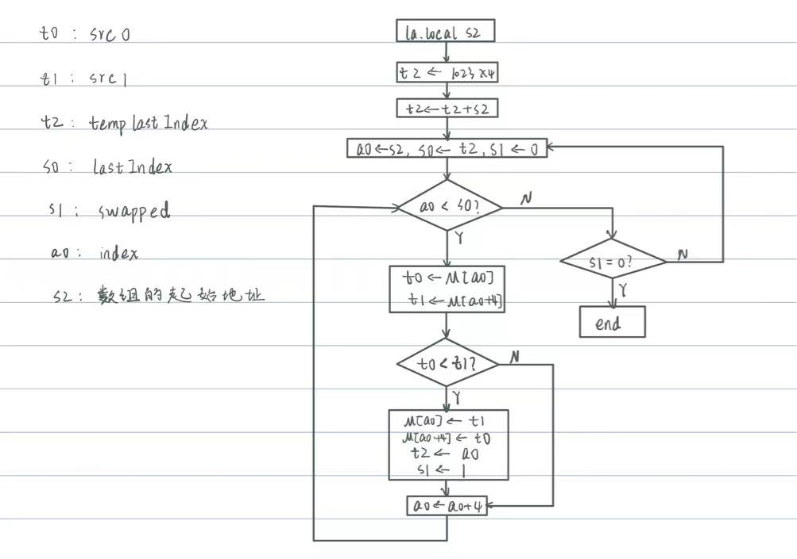
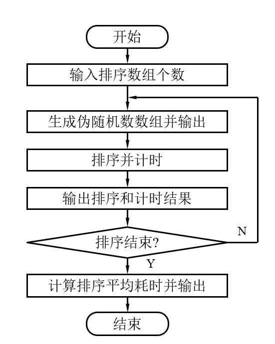

# <center>LabH6 - 综合设计

<center>PB22081571 薄震宇</center>

[TOC]

## 实验目的

本次实验的目的在于用汇编语言设计一个应用程序并在自己设计的CPU上运行。在设计的过程中，掌握SOC的设计和调试方法，掌握计算机输入输出的接口技术，了解计算机软硬件系统的优化方法。

## 实验内容

编写排序应用程序，首先接受用户输入的数组个数N，然后利用伽罗瓦LFSR生成1024个32位无符号数组成的伪随机数数组，然后利用排序算法进行排序并输出排序结果和耗时，当完成N个随机数数组的生成和排序后，显示排序平均耗时。

## 实验原理

### IO接口

本次实验并不是简单的让CPU执行一个任务，还需要与外界进行交互，所以需要利用IO接口来实现。龙芯的IO接口的地址如下：

```asm
# TIMER_ADDR		0xbfafe000	// 计时器
# LED_ADDR		    0xbfaff020	// 16个LED指示灯
# LED_RG0_ADDR		0xbfaff030	// 双色LED指示灯0
# LED_RG1_ADDR		0xbfaff040	// 双色LED指示灯1
# NUM_ADDR		    0xbfaff050	// 8个7段数码管
# SWITCH_ADDR		0xbfaff060	// 16个开关
# BTN_STEP_ADDR		0xbfaff080	// 2个按钮
```

本次实验所使用的主要有计时器，LED指示灯，8个7段数码管，16个开关和两个按钮。

* 计时器的使用为单向的读取，以获得排序开始和结束时的时间，相减即可得排序耗时。
* LED指示灯的使用为单向的存储，以显示我们想要显示的状态，例如我希望在拨动开关时对应的LED指示灯亮起，在全部任务完成时LED指示灯全亮。
* 8个7段数码管的使用也为单向的存储，主要为在生成了随机数数组和排序完成后显示数组数据。
* 16个开关的使用为单向的读取，主要表现为：读取数组个数N，读取要显示的数据的下标，读取显示数组数据还是排序时间的标志位。
* 两个按钮的使用为单向的读取，主要表示为控制程序的进行与暂停，按下按钮可以使程序往后继续执行。

需要注意的是，这里我对龙芯提供的实验环境中的`confreg.v`做了些许修改以满足IO需求。主要为下面的内容：

1. 将`switch`由8位宽改为15位宽以充分利用开发板的IO接口，当然`soc_top.v`中`switch`相应的部分也需要做修改。

2. 将`conf_rdata`的赋值由时序逻辑改为组合逻辑，否则外设的输入没有反应：

   ```verilog
   assign conf_rdata = (~resetn || !conf_en)?32'd0:
                       (conf_addr[15:0]==`CR0_ADDR         )? cr0 :
                       (conf_addr[15:0]==`CR1_ADDR         )? cr1 :
                       (conf_addr[15:0]==`CR2_ADDR         )? cr2 :
                       (conf_addr[15:0]==`CR3_ADDR         )? cr3 :        
                       (conf_addr[15:0]==`CR4_ADDR         )? cr4 :
                       (conf_addr[15:0]==`CR5_ADDR         )? cr5 :      
                       (conf_addr[15:0]==`CR6_ADDR         )? cr6 :       
                       (conf_addr[15:0]==`CR7_ADDR         )? cr7 :  
                       (conf_addr[15:0]==`LED_ADDR         )? led_data:  
                       (conf_addr[15:0]==`LED_RG0_ADDR     )? led_rg0_data :
                       (conf_addr[15:0]==`LED_RG1_ADDR     )? led_rg1_data :
                       (conf_addr[15:0]==`NUM_ADDR         )? num_data     :
                       (conf_addr[15:0]==`SWITCH_ADDR      )? switch_data  :
                       //(conf_addr[15:0]==`BTN_KEY_ADDR     )? btn_key_data :
                       (conf_addr[15:0]==`BTN_STEP_ADDR    )? btn_step_data :
                       (conf_addr[15:0]==`SW_INTER_ADDR    )? sw_inter_data :
                       (conf_addr[15:0]==`TIMER_ADDR       )? timer_r2     :
                       (conf_addr[15:0]==`SIMU_FLAG_ADDR   )? simu_flag    :
                       (conf_addr[15:0]==`IO_SIMU_ADDR     )? io_simu      :
                       (conf_addr[15:0]==`VIRTUAL_UART_ADDR)? {24'd0,virtual_uart_data} :
                       (conf_addr[15:0]==`OPEN_TRACE_ADDR  )? {31'd0,open_trace}  :
                       (conf_addr[15:0]==`NUM_MONITOR_ADDR )? {31'd0,num_monitor} :
                                                              32'd0;
   ```

3. 修改`btn_step_data`的赋值修改如下：

   ```verilog
   //assign btn_step_data = {30'd0,~btn_step0_r,~btn_step1_r};
   assign btn_step_data = {30'd0,btn_step0_r,btn_step1_r};
   ```

   这样修改是为了使按下按钮时`btn_step_data`的对应位为1而不是0，更符合设计的常理。

需要注意的是，不能简单的直接读取开关状态来判断是否已经按下开关，因为开关状态会有扰动，询问助教知可能是毛刺造成，对于开关的读取的方式如下：

```asm
READBTNC:
    addi.w      a6, zero, 2                 # a6 <- 2
    addi.w      s7, ra, 0                   # s7 <- ra，存储ra的值因为后续ra会发生改变
READBTNC_LOOP:
    ld.w        a5, a1, 0x080               # 获得按键状态
    andi        a5, a5, 2                   # 获取按键状态的第2位即中键的状态
    and         a6, a5, a6                  # a6 <- a5&a6
    jirl        ra, sp, 0                   # sp指向等待按键按下时要执行的任务
    bge         a6, a5, READBTNC_LOOP       # 若a6>=a5则继续等待按键按下
    jirl        zero, s7, 0                 # 返回
```

其中`a6`用于存储中键的状态，`a5`存储中键上一次和现在的状态是否相同，当`a6 >= a5`时说明按下了中键，具体来说，我想要捕捉按下按键的那一瞬间。

其中的`sp`指向等待按键按下时要执行的任务，如显示数组数据，读取开关输入等。

### 伽罗瓦LFSR算法

伽罗瓦LFSR算法用于生成伪随机数，它依赖于初值和本原多项式。生成32位随机数的本原多项式为$x^{32} + x^{31} + x^{30} + x^{10} + 1$，对应的16进制数为`0xe0000200`。它的设计逻辑为：将当前数值的最后一位与本原多项式对应项的前一位进行异或操作后赋值给本原多项式的对应位。具体实现逻辑如下：

* 若`x1 == 0`，则新的随机数即为当前的数值右移一位。
* 若`x1 == 1`，则新的随机数即为将当前的数值右移一位后再将本原多项式的对应位取反。

所以只需先将当前的随机数右移一位并保存最后一位，若最后一位为1则将其与`0xe000200`异或。

根据这个逻辑，利用初值生成1024个伪随机数并存储在数据空间中即可。

代码实现如下：

```asm
	li.w		t0, 0xe0000200
LFSR:
    addi.w      a7, a0,   4             # a7 <- a0 + 4
    addi.w      s6, s0,   0             # s6 <- s0
    addi.w      t1, zero, 1             # t1 <- 1
    addi.w      tp, zero, 0             # tp <- 0
    st.w        s6, a0,   0             # MEM[a0] <- s6
    addi.w      t6, zero, 1024          # t6 <- 1024
LFSRLOOP:
    bgeu        t1, t6,   RET1          # if t1 >= t6 then return
    andi        tp, s6, 1               # tp <- s6 & 1
    srli.w      s6, s6, 1               # s6 <- s6 >> 1
    beq         tp, zero, STORE         # if tp == 0 then goto STORE
    xor         s6, s6, t0              # s6 <- s6 ^ t0
STORE:
    st.w        s6, a7, 0               # MEM[a7] <- s6
    addi.w      a7, a7, 4               # a7 <- a7 + 4
    addi.w      t1, t1, 1               # t1 <- t1 + 1
    addi.w      tp, zero, 0             # tp <- 0
    b           LFSRLOOP                # goto LFSRLOOP
RET1:
    jirl        zero, ra, 0             # return
```

### 排序算法

本次实验使用的排序算法为冒泡排序的改进版，传统的冒泡排序是通过两层循环，每一次内层循环都将未排过序的数中最小（大）的数交换到最后，外层循环执行次数为数组长度（设为n）减1，以将n-1个最大（小）的数依次放到最后。实验中对算法做了以下两点优化：

1. 使用一个变量`swapped`来记录一趟排序中是否发生了交换，如没有则说明已经排好了序。
2. 使用一个变量`lastIndex`来存储上一趟排序中最后一次交换的两个元素的下标的较小值，则本次循环中位于`lastIndex`后的数据都是已排好序的数据，不需要再比较。

这一部分的流程图如下：



实验中对上述流程做了一些修改，主要体现为寄存器号的变动（为了避免与程序中的其他部分冲突）和不需要通过`la.local`获得数组的起始地址，因为程序中数据数据的起始地址存储在`a0`中。代码如下：

```asm
# 排序子程序
SORT:
    li.w    	t5, 4092         	  # t5 <- 1023*4 = 4092
	add.w		t5, t5, a0            # t5 <- t5 + a0
extern_loop:
    addi.w  	a7, a0,   0           # a7存储数组起始地址
    addi.w  	a3, t5,   0           # a3存储lastIndex, 初始化为t5
    addi.w  	s8, zero, 0           # s8存储swapped
inner_loop:
    bgeu    	a7, a3,   judge       # 若index等于lastIndex则跳转
    ld.w    	t6, a7,   0
    ld.w    	t1, a7,   4
    bgeu    	t6, t1,   addIndex
    st.w    	t1, a7,   0
    st.w    	t6, a7,   4
    addi.w  	t5, a7,   0
    addi.w  	s8, zero, 1
addIndex:
    addi.w  	a7, a7,   4
    b       	inner_loop
judge:
    bne     	s8, zero, extern_loop
    jirl        zero, ra, 0
```

### 流程设计

在完成上述模块的设计之后，只需要把它们串联起来即可。本次实验的流程设计主要参照PPT中要求：



具体步骤为：

* 首先将需要用到的常量存储在寄存器中并将需要用到的全局变量初始化，如下：

  ```asm
      li.w        a0, 0x1c800000  # 数据起始地址
      li.w        a1, 0xbfaff000  # 外设起始地址
      li.w        a2, 0xbfafe000  # 计时器地址
      li.w        s0, 0x12345678  # LFSR初始值
      li.w        t0, 0xe0000200  # LFSR本原多项式
      addi.w      t8, zero, 0     # 排序总耗时
      addi.w      s3, zero, 0     # 已排序数组个数
  ```

* 然后读取开关的高四位输入的数组个数N，只需要先将`sp`指向读取开关高四位的子程序`READN`，然后调用`READBTNC`子程序等待按键按下即可：

  ```asm
  	la.local    sp, READN
  	bl          READBTNC
  READN:
      ld.w        s1, a1, 0x060
      st.w        s1, a1, 0x020           # 用LED显示N
      srli.w      s1, s1, 12              # s1存储输入的N（由开关的高4位输入）
      st.w        s1, a1, 0x050           # 用数码管显示N
      jirl        zero, ra, 0
  ```

* 按下按键后，首先判断已排序的数组是否等于N，若等于则说明已完成全部数组的排序，跳转到最后显示平均时间，否则继续执行后面的代码，即`beq     s3, s1, SHOWAVERAGE`，其中`s1`存储读取的N。

* 使用伽瓦罗LFSR伪随机数生成算法生成伪随机数数组，然后等待按键按下以继续下一步，在等待按键按下的过程中，接受开关输入作为下标来显示相应位的数据，即将`sp`指向子程序`SHOWARRAY`然后调用`READBTNC`子程序：

  ```asm
  	bl          LFSR
      la.local    sp, SHOWARRAY
      bl          READBTNC
  SHOWARRAY:
      ld.w        a4, a1, 0x060       # 读取开关输入的下标
      st.w        a4, a1, 0x020       # LED灯显示下标
      slli.w      a4, a4, 4           # a4左移4位，以消除高四位影响
      srli.w      a4, a4, 2           # a4再右移2位以得到真正的偏移量
      add.w       a4, a4, a0          # 定位数据地址
      ld.w        t2, a4, 0           # 读取数据
      st.w        t2, a1, 0x050       # 显示数据
      jirl        zero, ra, 0
  ```

* 按下按键后，调用排序子程序对数组进行排序，排序前后需要分别读取一次计时器，并且在排序完成后用排序完成后减去排序完成前的时间以得到排序耗费的时间，再将该次排序的时间累加的排序的总时间上，然后等待按键按下以继续下一步，在等待按键按下的过程中，接受开关输入作为下标来显示相应位的数据，并且在开关的第12位为1时显示排序耗时，即将`sp`指向子程序`SHOWBOTH`然后调用`READBTNC`子程序：

  ```asm
  	ld.w        t2, a2, 0           # 读取计时器
      bl          SORT                # 调用排序子程序
      ld.w        t3, a2, 0           # 再次读取计时器
      sub.w       t7, t3, t2          # 计算排序所用时间
      add.w       t8, t7, t8          # 累加排序所用时间
      
      la.local    sp, SHOWBOTH   
      bl          READBTNC
  SHOWBOTH:
      ld.w        a4, a1, 0x060       # 读取开关输入的下标
      st.w        a4, a1, 0x020       # LED灯显示下标
      srli.w      t2, a4, 11          # 读取开关的第12位
      andi        t2, t2, 1           # 取开关的第12位
      bne         t2, zero, show_time
      slli.w      a4, a4, 4           # a4左移4位，以消除高四位影响
      srli.w      a4, a4, 2           # a4再右移2位以得到真正的偏移量
      add.w       a4, a4, a0          # 定位数据地址
      ld.w        t2, a4, 0           # 读取数据
      st.w        t2, a1, 0x050       # 显示数据
      jirl        zero, ra, 0
  ```

  `SHOWBOTH`与`SHOWARRAY`的不同之处在于前者会取开关的第12位以判断是要显示排序时间还是排序后的数组数据。

* 然后将`s3`自增1表示又完成了一个数组的排序，跳转到比较`s1`与`s3`的地方。

* 当`s3 == s1`时说明完成了指定数目的伪随机数数组的生成与排序，进入显示排序平均耗时的部分。由于设计的CPU并未实现除法且实验中要求N只有`0, 2, 4, 8`这几种可能，所以只需要根据N的值来处理即可：

  * N = 0或1时，直接显示总时间。
  * N = 2时，将总时间右移一位后显示。
  * N = 4时，将总时间右移两位后显示。
  * N = 8时，将总时间右移三位后显示。

  代码如下：

  ```asm
  SHOWAVERAGE:
      beq         s1, zero, SHOW
      addi.w      s1, s1, -1
      beq         s1, zero, SHOW
      addi.w      s1, s1, -1
      beq         s1, zero, DIVIDE2
      addi.w      s1, s1, -2
      beq         s1, zero, DIVIDE4
      b           DIVIDE8
  DIVIDE2:
      srli.w      t8, t8, 1
      b           SHOW
  DIVIDE4:
      srli.w      t8, t8, 2
      b           SHOW
  DIVIDE8:
      srli.w      t8, t8, 3
  SHOW:
      st.w        t8, a1, 0x050       # 显示平均排序时间  
      li.w        a2, 0x0000ffff
      st.w        a2, a1, 0x020       # LED灯全亮  
  ```

* 程序的最后是一个死循环，显示排序平均耗时，LED指示灯全亮。

## 实验结果

实验结果如下：

接受开关输入N：

生成随机数数组：

排完序后的数组：

单次排序的耗时：

完成N个随机数数组的生成与排序后：

由于每次生成随机数数组的初值和算法相同，所以每次生成的数组都相同，排序的结果与耗时也都相同，最后排序的平均时间与单次排序的耗时也相同。

## 实验总结

本次实验在逻辑上较为容易，只需要根据流程一步步设计即可，将本次实验拆分成一个个小的实验，设计相应的子程序可以使得逻辑更为清晰，需要注意的是调用子程序时需要保护现场和恢复现场，但是由于LARS有32个寄存器足够使用，所以我在设计时尽量使子程序与主程序和其他子程序使用不同的寄存器，即使有相同的寄存器也尽量不引起冲突，最终不需要保护现场和恢复现场。

本次实验的难点在于外设的处理上，包括我对`confreg.v`的修改和对按键的读取。未修改`confreg.v`时无论怎样拨动开关或是按下按键都没有反应，直接读取按键状态来使用时按键的状态并不稳定，即使不按按键也会在各种可能的值之间变动。

## 源码

由于本次实验只完成了应用程序的设计，并没有实现其他可选内容即没有对CPU的设计进行修改，所以这里粘贴汇编程序的代码如下：

```asm
# TIMER_ADDR		0xbfafe000	// 计时器

# LED_ADDR		    0xbfaff020	// 16个LED指示灯
# LED_RG0_ADDR		0xbfaff030	// 双色LED指示灯0
# LED_RG1_ADDR		0xbfaff040	// 双色LED指示灯1
# NUM_ADDR		    0xbfaff050	// 8个7段数码管
# SWITCH_ADDR		0xbfaff060	// 16个开关
# BTN_STEP_ADDR		0xbfaff080	// 2个按钮

# initialtion
    li.w        a0, 0x1c800000  # 数据起始地址
    li.w        a1, 0xbfaff000  # 外设起始地址
    li.w        a2, 0xbfafe000  # 计时器地址
    li.w        s0, 0x12345678  # LFSR初始值
    li.w        t0, 0xe0000200  # LFSR本原多项式
    addi.w      t8, zero, 0     # 排序总耗时
    addi.w      s3, zero, 0     # 已排序数组个数

    la.local    sp, READN
    bl          READBTNC
JUDGE1:
    beq         s3, s1, SHOWAVERAGE
    bl          LFSR
    la.local    sp, SHOWARRAY
    bl          READBTNC
    
    ld.w        t2, a2, 0           # 读取计时器
    bl          SORT                # 调用排序子程序
    ld.w        t3, a2, 0           # 再次读取计时器
    sub.w       t7, t3, t2          # 计算排序所用时间
    add.w       t8, t7, t8          # 累加排序所用时间
    
    la.local    sp, SHOWBOTH   
    bl          READBTNC
    addi.w      s3, s3, 1
    b           JUDGE1
SHOWAVERAGE:
    beq         s1, zero, SHOW
    addi.w      s1, s1, -1
    beq         s1, zero, SHOW
    addi.w      s1, s1, -1
    beq         s1, zero, DIVIDE2
    addi.w      s1, s1, -2
    beq         s1, zero, DIVIDE4
    b           DIVIDE8
DIVIDE2:
    srli.w      t8, t8, 1
    b           SHOW
DIVIDE4:
    srli.w      t8, t8, 2
    b           SHOW
DIVIDE8:
    srli.w      t8, t8, 3
SHOW:
    st.w        t8, a1, 0x050       # 显示平均排序时间  
    li.w        a2, 0x0000ffff
    st.w        a2, a1, 0x020       # LED灯全亮    
ENDLESSLOOP:
    b           ENDLESSLOOP


SHOWARRAY:
    ld.w        a4, a1, 0x060       # 读取开关输入的下标
    st.w        a4, a1, 0x020       # LED灯显示下标
    slli.w      a4, a4, 4           # a4左移4位，以消除高四位影响
    srli.w      a4, a4, 2           # a4再右移2位以得到真正的偏移量
    add.w       a4, a4, a0          # 定位数据地址
    ld.w        t2, a4, 0           # 读取数据
    st.w        t2, a1, 0x050       # 显示数据
    jirl        zero, ra, 0

SHOWBOTH:
    ld.w        a4, a1, 0x060       # 读取开关输入的下标
    st.w        a4, a1, 0x020       # LED灯显示下标
    srli.w      t2, a4, 11          # 读取开关的第12位
    andi        t2, t2, 1           # 取开关的第12位
    bne         t2, zero, show_time
    slli.w      a4, a4, 4           # a4左移4位，以消除高四位影响
    srli.w      a4, a4, 2           # a4再右移2位以得到真正的偏移量
    add.w       a4, a4, a0          # 定位数据地址
    ld.w        t2, a4, 0           # 读取数据
    st.w        t2, a1, 0x050       # 显示数据
    jirl        zero, ra, 0
show_time:
    st.w        t7, a1, 0x050
    jirl        zero, ra, 0

SHOWTIME:
    st.w        t7, a1, 0x050
    jirl        zero, ra, 0


READN:
    ld.w        s1, a1, 0x060
    st.w        s1, a1, 0x020           # 用LED显示N
    srli.w      s1, s1, 12              # s1存储输入的N（由开关的高4位输入）
    st.w        s1, a1, 0x050           # 用数码管显示N
    jirl        zero, ra, 0


LFSR:
    addi.w      a7, a0,   4             # a7 <- a0 + 4
    addi.w      s6, s0,   0             # s6 <- s0
    addi.w      t1, zero, 1             # t1 <- 1
    addi.w      tp, zero, 0             # tp <- 0
    st.w        s6, a0,   0             # MEM[a0] <- s6
    addi.w      t6, zero, 1024          # t6 <- 1024
LFSRLOOP:
    bgeu        t1, t6,   RET1          # if t1 >= t6 then return
    andi        tp, s6, 1               # tp <- s6 & 1
    srli.w      s6, s6, 1               # s6 <- s6 >> 1
    beq         tp, zero, STORE         # if tp == 0 then goto STORE
    xor         s6, s6, t0              # s6 <- s6 ^ t0
STORE:
    st.w        s6, a7, 0               # MEM[a7] <- s6
    addi.w      a7, a7, 4               # a7 <- a7 + 4
    addi.w      t1, t1, 1               # t1 <- t1 + 1
    addi.w      tp, zero, 0             # tp <- 0
    b           LFSRLOOP                # goto LFSRLOOP
RET1:
    jirl        zero, ra, 0             # return


# 排序子程序
SORT:
    li.w    	t5, 4092         	  # t5 <- 1023*4 = 4092
	add.w		t5, t5, a0            # t5 <- t5 + a0
extern_loop:
    addi.w  	a7, a0,   0           # a7存储数组起始地址
    addi.w  	a3, t5,   0           # a3存储lastIndex, 初始化为t5
    addi.w  	s8, zero, 0           # s8存储swapped
inner_loop:
    bgeu    	a7, a3,   judge       # 若index等于lastIndex则跳转
    ld.w    	t6, a7,   0
    ld.w    	t1, a7,   4
    bgeu    	t6, t1,   addIndex
    st.w    	t1, a7,   0
    st.w    	t6, a7,   4
    addi.w  	t5, a7,   0
    addi.w  	s8, zero, 1
addIndex:
    addi.w  	a7, a7,   4
    b       	inner_loop
judge:
    bne     	s8, zero, extern_loop
    jirl        zero, ra, 0


READBTNC:
    addi.w      a6, zero, 2                 # a6 <- 2
    addi.w      s7, ra, 0                   # s7 <- ra，存储ra的值因为后续ra会发生改变
READBTNC_LOOP:
    ld.w        a5, a1, 0x080               # 获得按键状态
    andi        a5, a5, 2                   # 获取按键状态的第2位即中键的状态
    and         a6, a5, a6                  # a6 <- a5&a6
    jirl        ra, sp, 0                   # sp指向等待按键按下时要执行的任务
    bge         a6, a5, READBTNC_LOOP       # 若a6>=a5则继续等待按键按下
    jirl        zero, s7, 0                 # 返回
```

