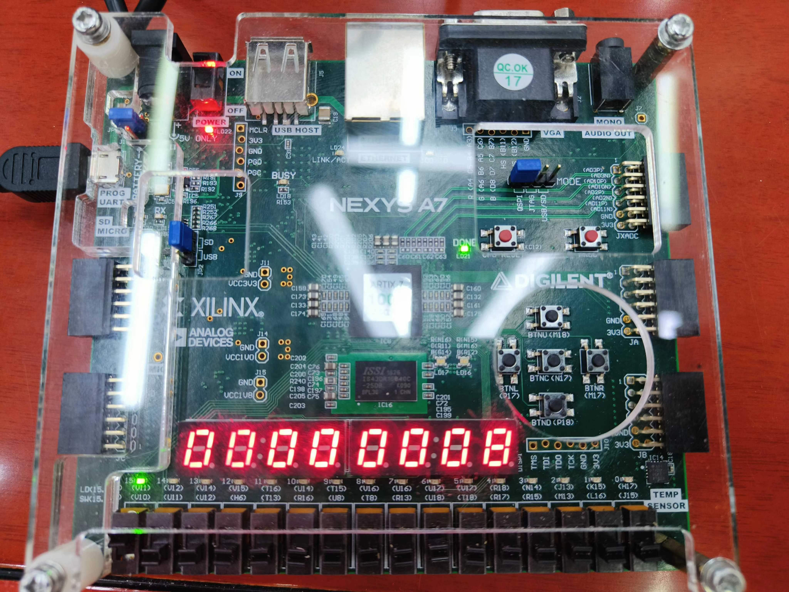
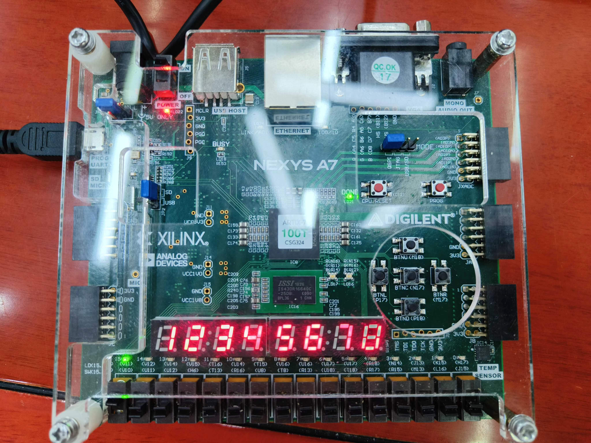
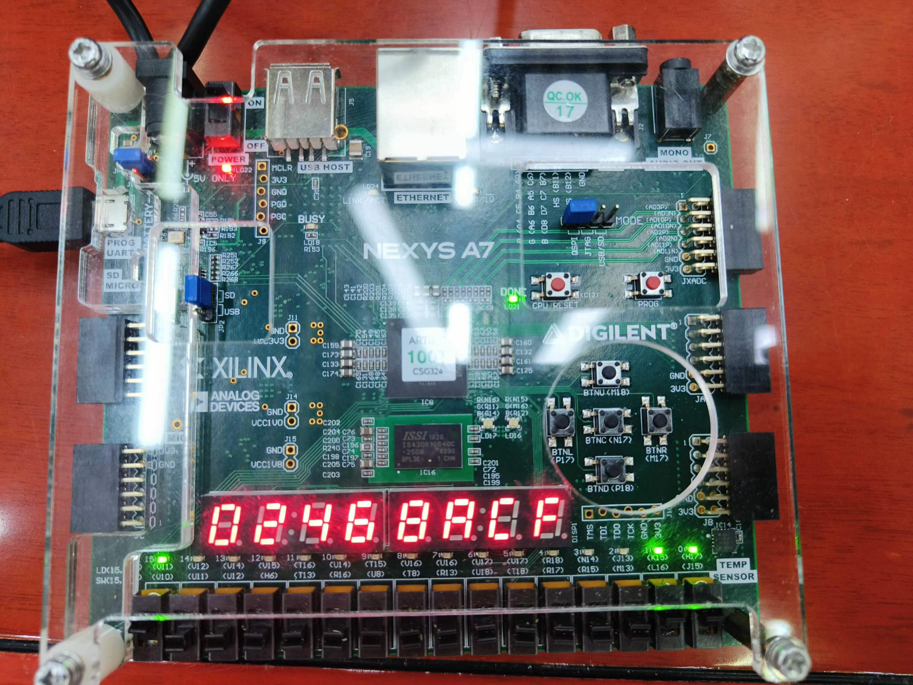
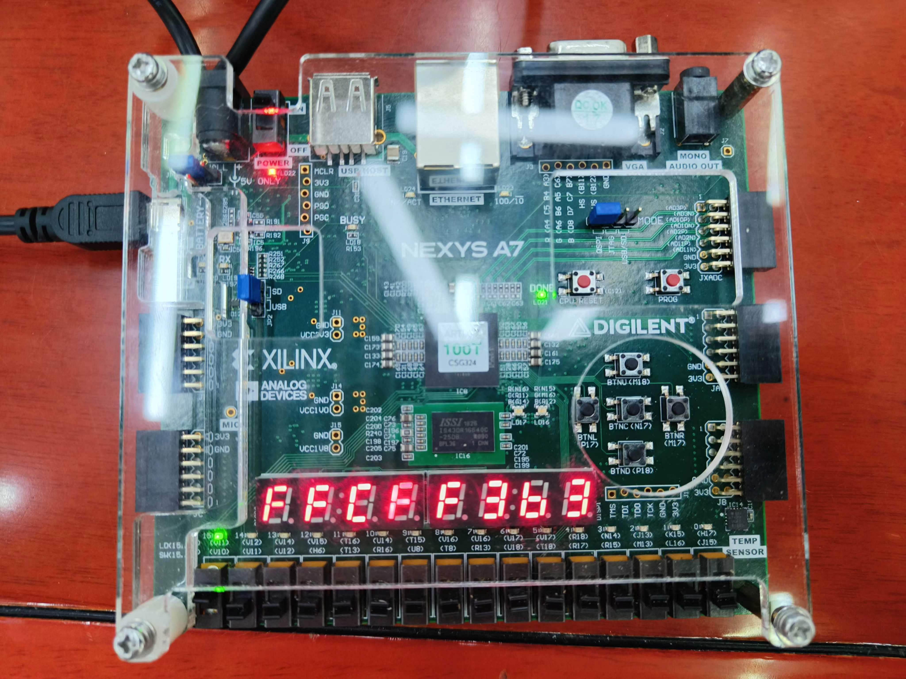
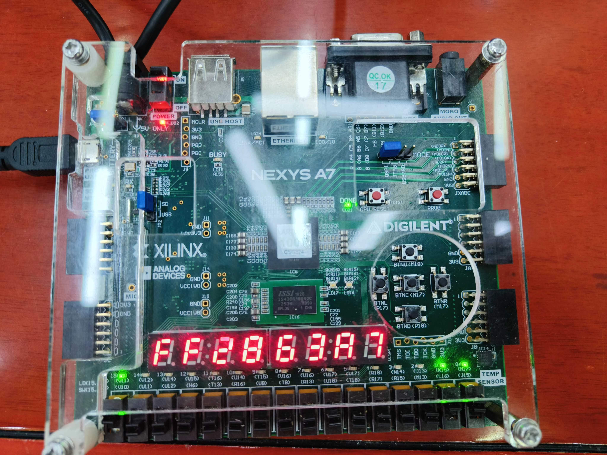
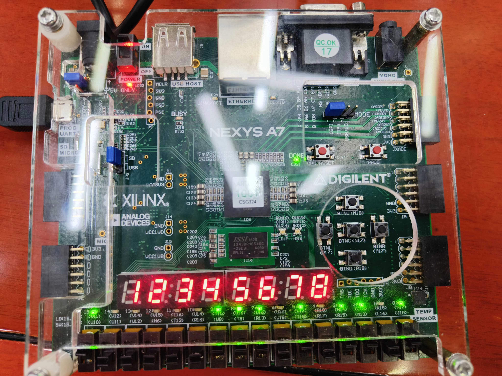
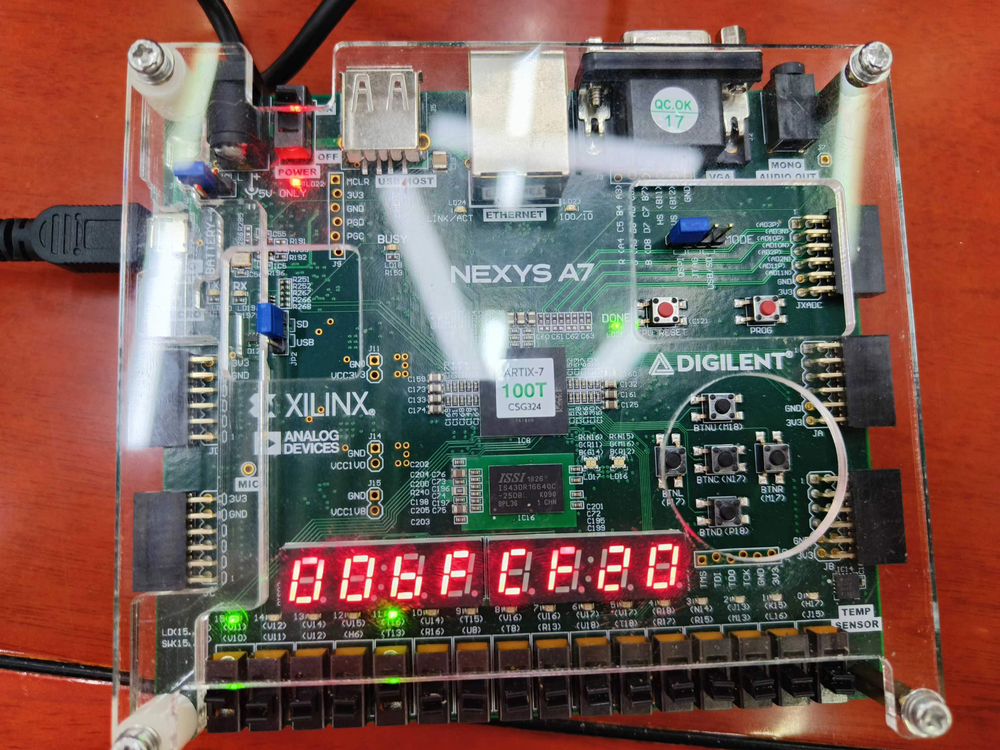
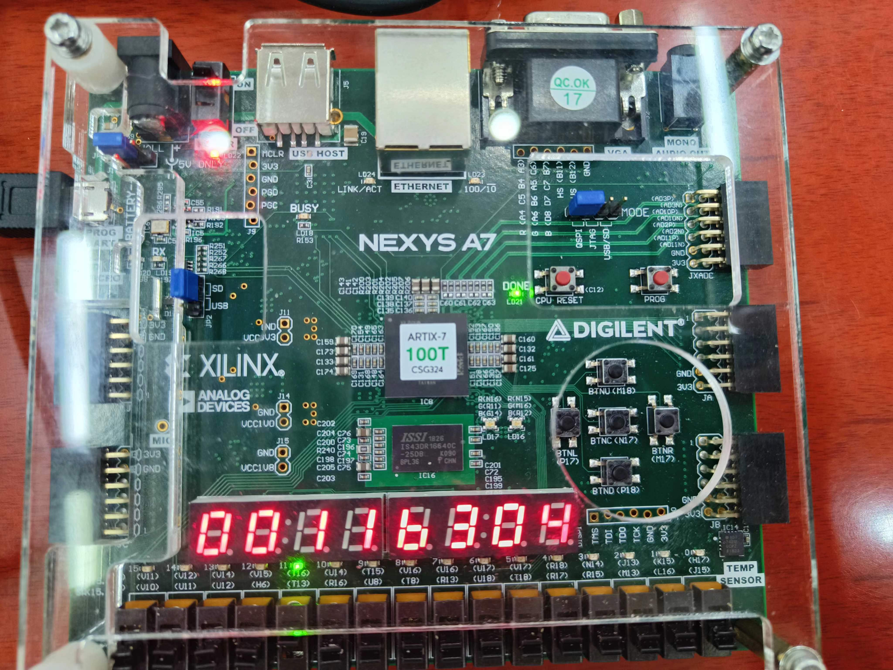
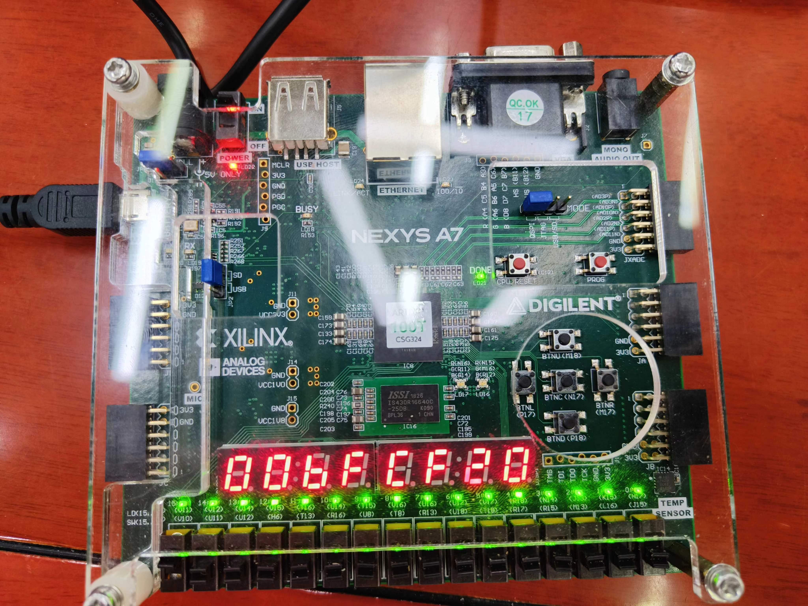
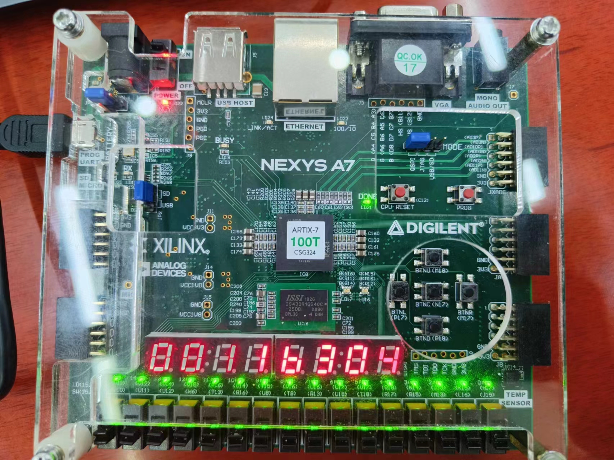

# <center>LabH6 - 综合设计

<center>PB22081571 薄震宇</center>

[TOC]

## 实验目的

本次实验的目的在于用汇编语言设计一个应用程序并在自己设计的CPU上运行。在设计的过程中，掌握SOC的设计和调试方法，掌握计算机输入输出的接口技术，了解计算机软硬件系统的优化方法。

## 实验内容

编写排序应用程序，首先接受用户输入的数组个数N，然后利用伽罗瓦LFSR生成1024个32位无符号数组成的伪随机数数组，然后利用排序算法进行排序并输出排序结果和耗时，当完成N个随机数数组的生成和排序后，显示排序平均耗时。

## 实验原理

### IO接口

本次实验并不是简单的让CPU执行一个任务，还需要与外界进行交互，所以需要利用IO接口来实现。龙芯的IO接口的地址如下：

```asm
# TIMER_ADDR		0xbfafe000	// 计时器
# LED_ADDR			0xbfaff020	// 16个LED指示灯
# LED_RG0_ADDR		0xbfaff030	// 双色LED指示灯0
# LED_RG1_ADDR		0xbfaff040	// 双色LED指示灯1
# NUM_ADDR			0xbfaff050	// 8个7段数码管
# SWITCH_ADDR		0xbfaff060	// 16个开关
# BTN_STEP_ADDR		0xbfaff080	// 2个按钮
```

本次实验所使用的主要有计时器，LED指示灯，8个7段数码管，16个开关和两个按钮。

* 计时器的使用为单向的读取，以获得排序开始和结束时的时间，相减即可得排序耗时。
* LED指示灯的使用为单向的存储，以显示我们想要显示的状态，例如我希望在拨动开关时对应的LED指示灯亮起，在全部任务完成时LED指示灯全亮。
* 8个7段数码管的使用也为单向的存储，主要为在生成了随机数数组和排序完成后显示数组数据。
* 16个开关的使用为单向的读取，主要表现为：读取数组个数N，读取要显示的数据的下标，读取显示数组数据还是排序时间的标志位。
* 两个按钮的使用为单向的读取，主要表示为控制程序的进行与暂停，按下按钮可以使程序往后继续执行。

需要注意的是，这里我对龙芯提供的实验环境中的`confreg.v`和`soc_top.v`做了些许修改以满足IO需求。主要为下面的内容：

1. 将`switch`由8位宽改为15位宽以充分利用开发板的IO接口，`soc_top.v`中`switch`相应的部分也需要做修改。

2. 将`conf_rdata`的赋值由时序逻辑改为组合逻辑，否则外设的输入没有反应：

   ```verilog
   assign conf_rdata = (~resetn || !conf_en)?32'd0:
                       (conf_addr[15:0]==`CR0_ADDR         )? cr0 :
                       (conf_addr[15:0]==`CR1_ADDR         )? cr1 :
                       (conf_addr[15:0]==`CR2_ADDR         )? cr2 :
                       (conf_addr[15:0]==`CR3_ADDR         )? cr3 :        
                       (conf_addr[15:0]==`CR4_ADDR         )? cr4 :
                       (conf_addr[15:0]==`CR5_ADDR         )? cr5 :      
                       (conf_addr[15:0]==`CR6_ADDR         )? cr6 :       
                       (conf_addr[15:0]==`CR7_ADDR         )? cr7 :  
                       (conf_addr[15:0]==`LED_ADDR         )? led_data:  
                       (conf_addr[15:0]==`LED_RG0_ADDR     )? led_rg0_data :
                       (conf_addr[15:0]==`LED_RG1_ADDR     )? led_rg1_data :
                       (conf_addr[15:0]==`NUM_ADDR         )? num_data     :
                       (conf_addr[15:0]==`SWITCH_ADDR      )? switch_data  :
                       //(conf_addr[15:0]==`BTN_KEY_ADDR     )? btn_key_data :
                       (conf_addr[15:0]==`BTN_STEP_ADDR    )? btn_step_data :
                       (conf_addr[15:0]==`SW_INTER_ADDR    )? sw_inter_data :
                       (conf_addr[15:0]==`TIMER_ADDR       )? timer_r2     :
                       (conf_addr[15:0]==`SIMU_FLAG_ADDR   )? simu_flag    :
                       (conf_addr[15:0]==`IO_SIMU_ADDR     )? io_simu      :
                       (conf_addr[15:0]==`VIRTUAL_UART_ADDR)? {24'd0,virtual_uart_data} :
                       (conf_addr[15:0]==`OPEN_TRACE_ADDR  )? {31'd0,open_trace}  :
                       (conf_addr[15:0]==`NUM_MONITOR_ADDR )? {31'd0,num_monitor} :
                                                              32'd0;
   ```

3. 修改`btn_step_data`的赋值修改如下：

   ```verilog
   //assign btn_step_data = {30'd0,~btn_step0_r,~btn_step1_r};
   assign btn_step_data = {30'd0,btn_step0_r,btn_step1_r};
   ```

   这样修改是为了使按下按钮时`btn_step_data`的对应位为1而不是0，更符合设计的常理。

需要注意的是，不能简单的直接读取开关状态来判断是否已经按下开关，因为开关状态会有扰动，询问助教知可能是毛刺造成，对于开关的读取的方式如下：

```asm
READBTNC:
    addi.w      a6, zero, 2                 # a6 <- 2
    addi.w      s7, ra, 0                   # s7 <- ra，存储ra的值因为后续ra会发生改变
READBTNC_LOOP:
    ld.w        a5, a1, 0x080               # 获得按键状态
    andi        a5, a5, 2                   # 获取按键状态的第2位即中键的状态
    and         a6, a5, a6                  # a6 <- a5&a6
    jirl        ra, sp, 0                   # sp指向等待按键按下时要执行的任务
    bge         a6, a5, READBTNC_LOOP       # 若a6>=a5则继续等待按键按下
    jirl        zero, s7, 0                 # 返回
```

其中`a6`用于存储中键的状态，`a5`存储中键上一次和现在的状态是否相同，当`a6 >= a5`时说明按下了中键，具体来说，我想要捕捉按下按键的那一瞬间。

其中的`sp`指向等待按键按下时要执行的任务，如显示数组数据，读取开关输入等。

### 伽罗瓦LFSR算法

伽罗瓦LFSR算法用于生成伪随机数，它依赖于初值和本原多项式。生成32位随机数的本原多项式为$x^{32} + x^{31} + x^{30} + x^{10} + 1$，对应的16进制数为`0xe0000200`。它的设计逻辑为：将当前数值的最后一位与本原多项式对应项的前一位进行异或操作后赋值给本原多项式的对应位。具体实现逻辑如下：

* 若`x1 == 0`，则新的随机数即为当前的数值右移一位。
* 若`x1 == 1`，则新的随机数即为将当前的数值右移一位后再将本原多项式的对应位取反。

所以只需先将当前的随机数右移一位并保存最后一位，若最后一位为1则将其与`0xe000200`异或。

根据这个逻辑，利用初值生成1024个伪随机数并存储在数据空间中即可。

代码实现如下：

```asm
	li.w		t0, 0xe0000200
LFSR:
    addi.w      a7, a0,   4             # a7 <- a0 + 4
    addi.w      s6, s0,   0             # s6 <- s0
    addi.w      t1, zero, 1             # t1 <- 1
    addi.w      tp, zero, 0             # tp <- 0
    st.w        s6, a0,   0             # MEM[a0] <- s6
    addi.w      t6, zero, 1024          # t6 <- 1024
LFSRLOOP:
    bgeu        t1, t6,   RET1          # if t1 >= t6 then return
    andi        tp, s6, 1               # tp <- s6 & 1
    srli.w      s6, s6, 1               # s6 <- s6 >> 1
    beq         tp, zero, STORE         # if tp == 0 then goto STORE
    xor         s6, s6, t0              # s6 <- s6 ^ t0
STORE:
    st.w        s6, a7, 0               # MEM[a7] <- s6
    addi.w      a7, a7, 4               # a7 <- a7 + 4
    addi.w      t1, t1, 1               # t1 <- t1 + 1
    addi.w      tp, zero, 0             # tp <- 0
    b           LFSRLOOP                # goto LFSRLOOP
RET1:
    jirl        zero, ra, 0             # return
```

### 排序算法

本次实验起初我分布使用了时间复杂度为$O(n^2)$的冒泡排序和$O(nlogn)$的快速排序算法，下面分别介绍这两种排序算法。

#### 冒泡排序

本次实验使用的排序算法为冒泡排序的改进版，传统的冒泡排序是通过两层循环，每一次内层循环都将未排过序的数中最小（大）的数交换到最后，外层循环执行次数为数组长度（设为n）减1，以将n-1个最大（小）的数依次放到最后。实验中对算法做了以下两点优化：

1. 使用一个变量`swapped`来记录一趟排序中是否发生了交换，如没有则说明已经排好了序。
2. 使用一个变量`lastIndex`来存储上一趟排序中最后一次交换的两个元素的下标的较小值，则本次循环中位于`lastIndex`后的数据都是已排好序的数据，不需要再比较。

这一部分的流程图如下：


实验中对上述流程做了一些修改，主要体现为寄存器号的变动（为了避免与程序中的其他部分冲突）和不需要通过`la.local`获得数组的起始地址，因为程序中数据数据的起始地址存储在`a0`中。代码如下：

```asm
# 排序子程序
SORT:
    li.w    	t5, 4092         	  # t5 <- 1023*4 = 4092
	add.w		t5, t5, a0            # t5 <- t5 + a0
extern_loop:
    addi.w  	a7, a0,   0           # a7存储数组起始地址
    addi.w  	a3, t5,   0           # a3存储lastIndex, 初始化为t5
    addi.w  	s8, zero, 0           # s8存储swapped
inner_loop:
    bgeu    	a7, a3,   judge       # 若index等于lastIndex则跳转
    ld.w    	t6, a7,   0
    ld.w    	t1, a7,   4
    bgeu    	t6, t1,   addIndex
    st.w    	t1, a7,   0
    st.w    	t6, a7,   4
    addi.w  	t5, a7,   0
    addi.w  	s8, zero, 1
addIndex:
    addi.w  	a7, a7,   4
    b       	inner_loop
judge:
    bne     	s8, zero, extern_loop
    jirl        zero, ra, 0
```

#### 快速排序

快速排序的核心为使用递归，首先选取一个基准值，将比这个值大的都移到左边，小的都移到右边，然后对左右两边递归排序。首先写出C语言代码如下：

```c
#include <stdio.h>
#include <stdlib.h>

int partition(int arr[], int left, int right)
{
    int base = arr[left];
    while(left < right)
    {
        while(left < right && arr[right] <= base)
            right--;
        arr[left] = arr[right];
        while(left < right && arr[left] >= base)
            left++;
        arr[right] = arr[left];
    }
    arr[left] = base;
    return left;
}

void quick_sort(int arr[], int left, int right)
{
    if(left < right)
    {
        int pos = partition(arr, left, right);
        quick_sort(arr, left, pos - 1);
        quick_sort(arr, pos + 1, right);
    }
}
```

根据以上代码可以，用寄存器来存储使用的变量可以写出汇编代码。

首先写出`partition`子程序，下面是使用的各个寄存器：

* `a6`：存储形参`left`
* `a7`：存储形参`right`
* `t1`：存储基准值`base`
* `t5`：存储`arr[left]`
* `t6`：存储`arr[right]`
* `a5`：存储返回值`pos`

然后根据C语言一步一步转换得到汇编代码即可，其中对于循环条件`arr[right] <= base`，由于没有实现`<=`的命令，所以我在`arr[right] >= base`时跳转至循环外，然后再判断`arr[right]`是否等于`base`，若等于则再跳转回循环体中。最终可得`partition`子程序的代码如下：

```asm
partition:
    ld.w        t1, a3, 0                   # base <- MEM[left]
    addi.w      a6, a3, 0                   # a6 <- a3
    addi.w      a7, a4, 0                   # a7 <- a4
partition_loop:
    bge         a6, a7, partition_ret       # if a6 >= a7 then return
right_loop:
    bge         a6, a7, right_loop_end      # if a6 >= a7 then goto right_loop_end
    ld.w        t6, a7, 0
    bgeu        t6, t1, right_loop_end      # if MEM[right] >= base then goto right_loop_end
right_decrease:
    addi.w      a7, a7, -4                  # a7 <- a7 - 4
    b           right_loop                  # goto right_loop
right_loop_end:
    beq         t6, t1, right_decrease      # if MEM[right] == t1 then goto right_decrease
    ld.w        t6, a7, 0                   # t6 <- MEM[right]
    st.w        t6, a6, 0                   # MEM[left] <- MEM[right]
left_loop:
    bge         a6, a7, left_loop_end       # if a6 >= a7 then goto left_loop_end
    ld.w        t5, a6, 0                   # t5 <- MEM[left]
    bltu        t5, t1, left_loop_end       # if t5 < t1 then goto left_loop_end
    addi.w      a6, a6, 4                   # a6 <- a6 + 4
    b           left_loop                   # goto left_loop
left_loop_end:
    ld.w        t5, a6, 0                   # t5 <- MEM[left]
    st.w        t5, a7, 0                   # MEM[right] <- t5
    b           partition_loop              # goto loop
partition_ret:
    st.w        t1, a6, 0                   # MEM[left] <- base
    addi.w      a5, a6, 0                   # pos <- left
    jirl        zero, ra, 0
```

然后再根据C代码写出快速排序的主体部分，这一部分逻辑上较为简单，只需要在`left < right`时首先调用`partition`子程序得到`pos`(存储在`a5`中)，然后递归调用自身，对左右两部分进行排序。

需要注意的是对于递归的处理，这里需要在进行递归进行前把后续需要用到的变量存入栈中，并在递归完成后取回。即`Save -> quick_sort -> Restore`。

由于`sp`被其他程序使用了，所以为了防止混乱，这里我使用`s8`作为栈指针。`s8`始终指向下一个可以用来存储的栈空间单元。所以要保存一个变量只需先将这个变量`st`至`s8`指向的存储单元，然后将`s8`自增4，相应的，想要取出一个变量只需先将`s8`自减4，然后`ld`出其指向的存储单元的值。

这里我使用的各个寄存器的作用如下：

* `a3`：存储`left`
* `a4`：存储`right`
* `a5`：`pos`，存储`partition`的返回值
* `ra`：存储返回地址
* `s8`：栈指针

然后根据C代码即可写出汇编代码：

```asm
quick_sort_prepare:
    li.w        s8, 0x1c801000              # s8 <- 0x1c801000
    addi.w      a3, a0, 0                   # left <- a0
    li.w        a4, 4092
    add.w       a4, a0, a4                  # right <- a0 + 4096
quick_sort:
    bge         a3, a4, quick_sort_ret      # if left >= right then return
    st.w        ra, s8, 0                   # store ra
    addi.w      s8, s8, 4                   # s8 <- s8 + 4
    bl          partition                   # call partition
    addi.w      s8, s8, -4                  # s8 <- s8 - 4
    ld.w        ra, s8, 0                   # load ra
    # qsort(left, pos-4)
    st.w        ra, s8, 0                   # store ra
    addi.w      s8, s8, 4                   # s8 <- s8 + 4
    st.w        a3, s8, 0                   # store left
    addi.w      s8, s8, 4                   # s8 <- s8 + 4
    st.w        a4, s8, 0                   # store right
    addi.w      s8, s8, 4                   # s8 <- s8 + 4
    st.w        a5, s8, 0                   # store pos
    addi.w      s8, s8, 4                   # s8 <- s8 + 4
    addi.w      a4, a5, -4                  # right <- pos - 4
    bl          quick_sort                  # call quick_sort
    addi.w      s8, s8, -4                  # s8 <- s8 - 4
    ld.w        a5, s8, 0                   # load pos
    addi.w      s8, s8, -4                  # s8 <- s8 - 4
    ld.w        a4, s8, 0                   # load right
    addi.w      s8, s8, -4                  # s8 <- s8 - 4
    ld.w        a3, s8, 0                   # load left
    addi.w      s8, s8, -4                  # s8 <- s8 - 4
    ld.w        ra, s8, 0                   # load ra
    # qsort(pos+4, right)
    st.w        ra, s8, 0                   # store ra
    addi.w      s8, s8, 4                   # s8 <- s8 + 4
    st.w        a3, s8, 0                   # store left
    addi.w      s8, s8, 4                   # s8 <- s8 + 4
    st.w        a4, s8, 0                   # store right
    addi.w      s8, s8, 4                   # s8 <- s8 + 4
    st.w        a5, s8, 0                   # store pos
    addi.w      s8, s8, 4                   # s8 <- s8 + 4
    addi.w      a3, a5, 4                   # left <- pos + 4
    bl          quick_sort                  # call quick_sort
    addi.w      s8, s8, -4                  # s8 <- s8 - 4
    ld.w        a5, s8, 0                   # load pos
    addi.w      s8, s8, -4                  # s8 <- s8 - 4
    ld.w        a4, s8, 0                   # load right
    addi.w      s8, s8, -4                  # s8 <- s8 - 4
    ld.w        a3, s8, 0                   # load left
    addi.w      s8, s8, -4                  # s8 <- s8 - 4
    ld.w        ra, s8, 0                   # load ra
quick_sort_ret:
    jirl        zero, ra, 0                 # return
```

### 流程设计

在完成上述模块的设计之后，只需要把它们串联起来即可。本次实验的流程设计主要参照PPT中要求：


具体步骤为：

* 首先将需要用到的常量存储在寄存器中并将需要用到的全局变量初始化，如下：

  ```asm
      li.w        a0, 0x1c800000  # 数据起始地址
      li.w        a1, 0xbfaff000  # 外设起始地址
      li.w        a2, 0xbfafe000  # 计时器地址
      li.w        s0, 0x12345678  # LFSR初始值
      li.w        t0, 0xe0000200  # LFSR本原多项式
      addi.w      t8, zero, 0     # 排序总耗时
      addi.w      s3, zero, 0     # 已排序数组个数
  ```

* 然后读取开关的高四位输入的数组个数N，只需要先将`sp`指向读取开关高四位的子程序`READN`，然后调用`READBTNC`子程序等待按键按下即可：

  ```asm
  	la.local    sp, READN
  	bl          READBTNC
  READN:
      ld.w        s1, a1, 0x060
      st.w        s1, a1, 0x020           # 用LED显示N
      srli.w      s1, s1, 12              # s1存储输入的N（由开关的高4位输入）
      st.w        s1, a1, 0x050           # 用数码管显示N
      jirl        zero, ra, 0
  ```

* 按下按键后，首先判断已排序的数组是否等于N，若等于则说明已完成全部数组的排序，跳转到最后显示平均时间，否则继续执行后面的代码，即`beq     s3, s1, SHOWAVERAGE`，其中`s1`存储读取的N。

* 使用伽瓦罗LFSR伪随机数生成算法生成伪随机数数组，然后等待按键按下以继续下一步，在等待按键按下的过程中，接受开关输入作为下标来显示相应位的数据，即将`sp`指向子程序`SHOWARRAY`然后调用`READBTNC`子程序：

  ```asm
  	bl          LFSR
      la.local    sp, SHOWARRAY
      bl          READBTNC
  SHOWARRAY:
      ld.w        a4, a1, 0x060       # 读取开关输入的下标
      st.w        a4, a1, 0x020       # LED灯显示下标
      slli.w      a4, a4, 4           # a4左移4位，以消除高四位影响
      srli.w      a4, a4, 2           # a4再右移2位以得到真正的偏移量
      add.w       a4, a4, a0          # 定位数据地址
      ld.w        t2, a4, 0           # 读取数据
      st.w        t2, a1, 0x050       # 显示数据
      jirl        zero, ra, 0
  ```

* 按下按键后，调用排序子程序对数组进行排序，排序前后需要分别读取一次计时器，并且在排序完成后用排序完成后减去排序完成前的时间以得到排序耗费的时间，再将该次排序的时间累加的排序的总时间上，然后等待按键按下以继续下一步，在等待按键按下的过程中，接受开关输入作为下标来显示相应位的数据，并且在开关的第12位为1时显示排序耗时，即将`sp`指向子程序`SHOWBOTH`然后调用`READBTNC`子程序：

  ```asm
  	ld.w        t2, a2, 0           # 读取计时器
      bl          SORT                # 调用排序子程序
      ld.w        t3, a2, 0           # 再次读取计时器
      sub.w       t7, t3, t2          # 计算排序所用时间
      add.w       t8, t7, t8          # 累加排序所用时间
      
      la.local    sp, SHOWBOTH   
      bl          READBTNC
  SHOWBOTH:
      ld.w        a4, a1, 0x060       # 读取开关输入的下标
      st.w        a4, a1, 0x020       # LED灯显示下标
      srli.w      t2, a4, 11          # 读取开关的第12位
      andi        t2, t2, 1           # 取开关的第12位
      bne         t2, zero, show_time
      slli.w      a4, a4, 4           # a4左移4位，以消除高四位影响
      srli.w      a4, a4, 2           # a4再右移2位以得到真正的偏移量
      add.w       a4, a4, a0          # 定位数据地址
      ld.w        t2, a4, 0           # 读取数据
      st.w        t2, a1, 0x050       # 显示数据
      jirl        zero, ra, 0
  ```

  `SHOWBOTH`与`SHOWARRAY`的不同之处在于前者会取开关的第12位以判断是要显示排序时间还是排序后的数组数据。

* 然后将`s3`自增1表示又完成了一个数组的排序，跳转到比较`s1`与`s3`的地方。

* 当`s3 == s1`时说明完成了指定数目的伪随机数数组的生成与排序，进入显示排序平均耗时的部分。由于设计的CPU并未实现除法且实验中要求N只有`0, 2, 4, 8`这几种可能，所以只需要根据N的值来处理即可：

  * N = 0或1时，直接显示总时间。
  * N = 2时，将总时间右移一位后显示。
  * N = 4时，将总时间右移两位后显示。
  * N = 8时，将总时间右移三位后显示。

  代码如下：

  ```asm
  SHOWAVERAGE:
      beq         s1, zero, SHOW
      addi.w      s1, s1, -1
      beq         s1, zero, SHOW
      addi.w      s1, s1, -1
      beq         s1, zero, DIVIDE2
      addi.w      s1, s1, -2
      beq         s1, zero, DIVIDE4
      b           DIVIDE8
  DIVIDE2:
      srli.w      t8, t8, 1
      b           SHOW
  DIVIDE4:
      srli.w      t8, t8, 2
      b           SHOW
  DIVIDE8:
      srli.w      t8, t8, 3
  SHOW:
      st.w        t8, a1, 0x050       # 显示平均排序时间  
      li.w        a2, 0x0000ffff
      st.w        a2, a1, 0x020       # LED灯全亮  
  ```

* 程序的最后是一个死循环，显示排序平均耗时，LED指示灯全亮。

## 实验结果

实验结果如下：

接受开关输入N：



可以看到开关高四位输入N，对应LED指示灯亮起并且数码管成功显示N。

生成随机数数组：



可以看到，按下中键后成功生成随机数数组并且以`12345678`为首项。

此时可通过开关输入下标来显示对应的数组数据：



排完序后的数组：



可以看到，按下中键后数组按照降序排好序，此时可通过开关输入下标来显示对应数组元素：



排完序后也可以找到`12345678`：



单次排序完成后，可通过拨动第12个开关来显示该次排序耗时：

冒泡排序结果：



快速排序结果：



完成N个随机数数组的生成与排序后：

冒泡排序结果：



快速排序结果：



可以看到，成功生成并排序N个伪随机数数组后，数码管显示排序的平均耗时，LED指示灯全亮。

并且快速排序的耗时明显远远少于冒泡排序。

由于每次生成随机数数组的初值和算法相同，所以每次生成的数组都相同，排序的结果与耗时也都相同，最后排序的平均时间与单次排序的耗时也相同。

## 实验总结

本次实验在逻辑上较为容易，只需要根据流程一步步设计即可，将本次实验拆分成一个个小的实验，设计相应的子程序可以使得逻辑更为清晰，需要注意的是调用子程序时需要保护现场和恢复现场，但是由于LARS有32个寄存器足够使用，所以我在设计时尽量使子程序与主程序和其他子程序使用不同的寄存器，即使有相同的寄存器也尽量不引起冲突，最终不需要保护现场和恢复现场。

本次实验的难点在于外设的处理上，包括我对`confreg.v`的修改和对按键的读取。未修改`confreg.v`时无论怎样拨动开关或是按下按键都没有反应，直接读取按键状态来使用时按键的状态并不稳定，即使不按按键也会在各种可能的值之间变动。

## 源码

由于这次实验只完成了应用程序的设计，为适应外设输入，修改了`confreg.v`和`soc_top.v`的部分内容，所以下面只粘贴汇编应用程序`lab6.s`，`confreg.v`和`soc_top.v`。

### lab6.s

```asm
# TIMER_ADDR		0xbfafe000	// 计时器

# LED_ADDR		    0xbfaff020	// 16个LED指示灯
# LED_RG0_ADDR		0xbfaff030	// 双色LED指示灯0
# LED_RG1_ADDR		0xbfaff040	// 双色LED指示灯1
# NUM_ADDR		    0xbfaff050	// 8个7段数码管
# SWITCH_ADDR		0xbfaff060	// 16个开关
# BTN_STEP_ADDR		0xbfaff080	// 2个按钮

# initialtion
    li.w        a0, 0x1c800000  # 数据起始地址
    li.w        a1, 0xbfaff000  # 外设起始地址
    li.w        a2, 0xbfafe000  # 计时器地址
    li.w        s0, 0x12345678  # LFSR初始值
    li.w        t0, 0xe0000200  # LFSR本原多项式
    addi.w      t8, zero, 0     # 排序总耗时
    addi.w      s3, zero, 0     # 已排序数组个数

    la.local    sp, READN
    bl          READBTNC
JUDGE1:
    beq         s3, s1, SHOWAVERAGE
    bl          LFSR
    la.local    sp, SHOWARRAY
    bl          READBTNC
    
    ld.w        t2, a2, 0           # 读取计时器
    bl          SORT                # 调用排序子程序
    # bl          quick_sort_prepare
    ld.w        t3, a2, 0           # 再次读取计时器
    sub.w       t7, t3, t2          # 计算排序所用时间
    add.w       t8, t7, t8          # 累加排序所用时间
    
    la.local    sp, SHOWBOTH   
    bl          READBTNC
    addi.w      s3, s3, 1
    b           JUDGE1
SHOWAVERAGE:
    beq         s1, zero, SHOW
    addi.w      s1, s1, -1
    beq         s1, zero, SHOW
    addi.w      s1, s1, -1
    beq         s1, zero, DIVIDE2
    addi.w      s1, s1, -2
    beq         s1, zero, DIVIDE4
    b           DIVIDE8
DIVIDE2:
    srli.w      t8, t8, 1
    b           SHOW
DIVIDE4:
    srli.w      t8, t8, 2
    b           SHOW
DIVIDE8:
    srli.w      t8, t8, 3
SHOW:
    st.w        t8, a1, 0x050       # 显示平均排序时间  
    li.w        a2, 0x0000ffff
    st.w        a2, a1, 0x020       # LED灯全亮    
ENDLESSLOOP:
    b           ENDLESSLOOP


SHOWARRAY:
    ld.w        a4, a1, 0x060       # 读取开关输入的下标
    st.w        a4, a1, 0x020       # LED灯显示下标
    slli.w      a4, a4, 4           # a4左移4位，以消除高四位影响
    srli.w      a4, a4, 2           # a4再右移2位以得到真正的偏移量
    add.w       a4, a4, a0          # 定位数据地址
    ld.w        t2, a4, 0           # 读取数据
    st.w        t2, a1, 0x050       # 显示数据
    jirl        zero, ra, 0

SHOWBOTH:
    ld.w        a4, a1, 0x060       # 读取开关输入的下标
    st.w        a4, a1, 0x020       # LED灯显示下标
    srli.w      t2, a4, 11          # 读取开关的第12位
    andi        t2, t2, 1           # 取开关的第12位
    bne         t2, zero, show_time
    slli.w      a4, a4, 4           # a4左移4位，以消除高四位影响
    srli.w      a4, a4, 2           # a4再右移2位以得到真正的偏移量
    add.w       a4, a4, a0          # 定位数据地址
    ld.w        t2, a4, 0           # 读取数据
    st.w        t2, a1, 0x050       # 显示数据
    jirl        zero, ra, 0
show_time:
    st.w        t7, a1, 0x050
    jirl        zero, ra, 0

SHOWTIME:
    st.w        t7, a1, 0x050
    jirl        zero, ra, 0


READN:
    ld.w        s1, a1, 0x060
    st.w        s1, a1, 0x020           # 用LED显示N
    srli.w      s1, s1, 12              # s1存储输入的N（由开关的高4位输入）
    st.w        s1, a1, 0x050           # 用数码管显示N
    jirl        zero, ra, 0


LFSR:
    addi.w      a7, a0,   4             # a7 <- a0 + 4
    addi.w      s6, s0,   0             # s6 <- s0
    addi.w      t1, zero, 1             # t1 <- 1
    addi.w      tp, zero, 0             # tp <- 0
    st.w        s6, a0,   0             # MEM[a0] <- s6
    addi.w      t6, zero, 1024          # t6 <- 1024
LFSRLOOP:
    bgeu        t1, t6,   RET1          # if t1 >= t6 then return
    andi        tp, s6, 1               # tp <- s6 & 1
    srli.w      s6, s6, 1               # s6 <- s6 >> 1
    beq         tp, zero, STORE         # if tp == 0 then goto STORE
    xor         s6, s6, t0              # s6 <- s6 ^ t0
STORE:
    st.w        s6, a7, 0               # MEM[a7] <- s6
    addi.w      a7, a7, 4               # a7 <- a7 + 4
    addi.w      t1, t1, 1               # t1 <- t1 + 1
    addi.w      tp, zero, 0             # tp <- 0
    b           LFSRLOOP                # goto LFSRLOOP
RET1:
    jirl        zero, ra, 0             # return


# 排序子程序
SORT:
    li.w    	t5, 4092         	  # t5 <- 1023*4 = 4092
	add.w		t5, t5, a0            # t5 <- t5 + a0
extern_loop:
    addi.w  	a7, a0,   0           # a7存储数组起始地址
    addi.w  	a3, t5,   0           # a3存储lastIndex, 初始化为t5
    addi.w  	s8, zero, 0           # s8存储swapped
inner_loop:
    bgeu    	a7, a3,   judge       # 若index等于lastIndex则跳转
    ld.w    	t6, a7,   0
    ld.w    	t1, a7,   4
    bgeu    	t6, t1,   addIndex
    st.w    	t1, a7,   0
    st.w    	t6, a7,   4
    addi.w  	t5, a7,   0
    addi.w  	s8, zero, 1
addIndex:
    addi.w  	a7, a7,   4
    b       	inner_loop
judge:
    bne     	s8, zero, extern_loop
    jirl        zero, ra, 0


READBTNC:
    addi.w      a6, zero, 2                 # a6 <- 2
    addi.w      s7, ra, 0                   # s7 <- ra，存储ra的值因为后续ra会发生改变
READBTNC_LOOP:
    ld.w        a5, a1, 0x080               # 获得按键状态
    andi        a5, a5, 2                   # 获取按键状态的第2位即中键的状态
    and         a6, a5, a6                  # a6 <- a5&a6
    jirl        ra, sp, 0                   # sp指向等待按键按下时要执行的任务
    bge         a6, a5, READBTNC_LOOP       # 若a6 >= a5则继续等待按键按下
    jirl        zero, s7, 0                 # 返回


partition:
    ld.w        t1, a3, 0                   # base <- MEM[left]
    addi.w      a6, a3, 0                   # a6 <- a3
    addi.w      a7, a4, 0                   # a7 <- a4
partition_loop:
    bge         a6, a7, partition_ret       # if a6 >= a7 then return
right_loop:
    bge         a6, a7, right_loop_end      # if a6 >= a7 then goto right_loop_end
    ld.w        t6, a7, 0
    bgeu        t6, t1, right_loop_end      # if MEM[right] >= base then goto right_loop_end
right_decrease:
    addi.w      a7, a7, -4                  # a7 <- a7 - 4
    b           right_loop                  # goto right_loop
right_loop_end:
    beq         t6, t1, right_decrease      # if MEM[right] == t1 then goto right_decrease
    ld.w        t6, a7, 0                   # t6 <- MEM[right]
    st.w        t6, a6, 0                   # MEM[left] <- MEM[right]
left_loop:
    bge         a6, a7, left_loop_end       # if a6 >= a7 then goto left_loop_end
    ld.w        t5, a6, 0                   # t5 <- MEM[left]
    bltu        t5, t1, left_loop_end       # if t5 < t1 then goto left_loop_end
    addi.w      a6, a6, 4                   # a6 <- a6 + 4
    b           left_loop                   # goto left_loop
left_loop_end:
    ld.w        t5, a6, 0                   # t5 <- MEM[left]
    st.w        t5, a7, 0                   # MEM[right] <- t5
    b           partition_loop              # goto loop
partition_ret:
    st.w        t1, a6, 0                   # MEM[left] <- base
    addi.w      a5, a6, 0                   # pos <- left
    jirl        zero, ra, 0


quick_sort_prepare:
    li.w        s8, 0x1c801000              # s8 <- 0x1c801000
    addi.w      a3, a0, 0                   # left <- a0
    li.w        a4, 4092
    add.w       a4, a0, a4                  # right <- a0 + 4096
quick_sort:
    bge         a3, a4, quick_sort_ret      # if left >= right then return
    st.w        ra, s8, 0                   # store ra
    addi.w      s8, s8, 4                   # s8 <- s8 + 4
    bl          partition                   # call partition
    addi.w      s8, s8, -4                  # s8 <- s8 - 4
    ld.w        ra, s8, 0                   # load ra
    # qsort(left, pos-4)
    st.w        ra, s8, 0                   # store ra
    addi.w      s8, s8, 4                   # s8 <- s8 + 4
    st.w        a3, s8, 0                   # store left
    addi.w      s8, s8, 4                   # s8 <- s8 + 4
    st.w        a4, s8, 0                   # store right
    addi.w      s8, s8, 4                   # s8 <- s8 + 4
    st.w        a5, s8, 0                   # store pos
    addi.w      s8, s8, 4                   # s8 <- s8 + 4
    addi.w      a4, a5, -4                  # right <- pos - 4
    bl          quick_sort                  # call quick_sort
    addi.w      s8, s8, -4                  # s8 <- s8 - 4
    ld.w        a5, s8, 0                   # load pos
    addi.w      s8, s8, -4                  # s8 <- s8 - 4
    ld.w        a4, s8, 0                   # load right
    addi.w      s8, s8, -4                  # s8 <- s8 - 4
    ld.w        a3, s8, 0                   # load left
    addi.w      s8, s8, -4                  # s8 <- s8 - 4
    ld.w        ra, s8, 0                   # load ra
    # qsort(pos+4, right)
    st.w        ra, s8, 0                   # store ra
    addi.w      s8, s8, 4                   # s8 <- s8 + 4
    st.w        a3, s8, 0                   # store left
    addi.w      s8, s8, 4                   # s8 <- s8 + 4
    st.w        a4, s8, 0                   # store right
    addi.w      s8, s8, 4                   # s8 <- s8 + 4
    st.w        a5, s8, 0                   # store pos
    addi.w      s8, s8, 4                   # s8 <- s8 + 4
    addi.w      a3, a5, 4                   # left <- pos + 4
    bl          quick_sort                  # call quick_sort
    addi.w      s8, s8, -4                  # s8 <- s8 - 4
    ld.w        a5, s8, 0                   # load pos
    addi.w      s8, s8, -4                  # s8 <- s8 - 4
    ld.w        a4, s8, 0                   # load right
    addi.w      s8, s8, -4                  # s8 <- s8 - 4
    ld.w        a3, s8, 0                   # load left
    addi.w      s8, s8, -4                  # s8 <- s8 - 4
    ld.w        ra, s8, 0                   # load ra
quick_sort_ret:
    jirl        zero, ra, 0                 # return
```

### confreg.v

```verilog
`define RANDOM_SEED {7'b1010101,16'h01FF}

`define CR0_ADDR       16'h8000   //32'hbfaf_8000
`define CR1_ADDR       16'h8010   //32'hbfaf_8010
`define CR2_ADDR       16'h8020   //32'hbfaf_8020
`define CR3_ADDR       16'h8030   //32'hbfaf_8030
`define CR4_ADDR       16'h8040   //32'hbfaf_8040
`define CR5_ADDR       16'h8050   //32'hbfaf_8050
`define CR6_ADDR       16'h8060   //32'hbfaf_8060
`define CR7_ADDR       16'h8070   //32'hbfaf_8070

`define LED_ADDR       16'hf020   //32'hbfaf_f020
`define LED_RG0_ADDR   16'hf030   //32'hbfaf_f030
`define LED_RG1_ADDR   16'hf040   //32'hbfaf_f040
`define NUM_ADDR       16'hf050   //32'hbfaf_f050
`define SWITCH_ADDR    16'hf060   //32'hbfaf_f060
`define BTN_KEY_ADDR   16'hf070   //32'hbfaf_f070
`define BTN_STEP_ADDR  16'hf080   //32'hbfaf_f080
`define SW_INTER_ADDR  16'hf090   //32'hbfaf_f090
`define TIMER_ADDR     16'he000   //32'hbfaf_e000

`define IO_SIMU_ADDR      16'hff00  //32'hbfaf_ff00
`define VIRTUAL_UART_ADDR 16'hff10  //32'hbfaf_ff10
`define SIMU_FLAG_ADDR    16'hff20  //32'hbfaf_ff20
`define OPEN_TRACE_ADDR   16'hff30  //32'hbfaf_ff30
`define NUM_MONITOR_ADDR  16'hff40  //32'hbfaf_ff40

module confreg
#(parameter SIMULATION=1'b0)
(
    input  wire        clk,
    input  wire        timer_clk,
    input  wire        resetn,

    // read and write from cpu
    input  wire        conf_en,
    input  wire [3 :0] conf_we,
    input  wire [31:0] conf_addr,
    input  wire [31:0] conf_wdata,
    output wire [31:0] conf_rdata,

    // read and write to device on board
    output wire [15:0] led,
    output wire [1 :0] led_rg0,
    output wire [1 :0] led_rg1,
    output reg  [7 :0] num_csn,
    output wire [6 :0] num_a_gn,	//changed for N4-DDR
//    output reg  [6 :0] num_a_g,	//changed for N4-DDR
//    output reg  [31:0] num_data,	//removed for N4-DDR
    input  wire [15:0] switch,
//    output wire [3 :0] btn_key_col,	//removed for N4-DDR
//    input  wire [3 :0] btn_key_row,	//removed for N4-DDR
    input  wire [1 :0] btn_step
);
    reg  [31:0] cr0;
    reg  [31:0] cr1;
    reg  [31:0] cr2;
    reg  [31:0] cr3;
    reg  [31:0] cr4;
    reg  [31:0] cr5;
    reg  [31:0] cr6;
    reg  [31:0] cr7;

    reg  [31:0] led_data;
    reg  [31:0] led_rg0_data;
    reg  [31:0] led_rg1_data;

    wire [31:0] switch_data;
    wire [31:0] sw_inter_data; 	//switch interleave
//    wire [31:0] btn_key_data;		//removed for N4-DDR
    wire [31:0] btn_step_data;

    reg  [7 :0] confreg_uart_data;
    reg         confreg_uart_valid;
    reg  [31:0] timer_r2;
    reg  [31:0] simu_flag;
    reg  [31:0] io_simu;
    reg  [7 :0] virtual_uart_data;
    reg         open_trace;
    reg         num_monitor;

    // read data has one cycle delay
    reg [31:0] conf_rdata_reg;
    
reg [31:0] num_data;
assign conf_rdata = (~resetn || !conf_en)?32'd0:
                    (conf_addr[15:0]==`CR0_ADDR         )? cr0 :
                    (conf_addr[15:0]==`CR1_ADDR         )? cr1 :
                    (conf_addr[15:0]==`CR2_ADDR         )? cr2 :
                    (conf_addr[15:0]==`CR3_ADDR         )? cr3 :        
                    (conf_addr[15:0]==`CR4_ADDR         )? cr4 :
                    (conf_addr[15:0]==`CR5_ADDR         )? cr5 :      
                    (conf_addr[15:0]==`CR6_ADDR         )? cr6 :       
                    (conf_addr[15:0]==`CR7_ADDR         )? cr7 :  
                    (conf_addr[15:0]==`LED_ADDR         )? led_data:  
                    (conf_addr[15:0]==`LED_RG0_ADDR     )? led_rg0_data :
                    (conf_addr[15:0]==`LED_RG1_ADDR     )? led_rg1_data :
                    (conf_addr[15:0]==`NUM_ADDR         )? num_data     :
                    (conf_addr[15:0]==`SWITCH_ADDR      )? switch_data  :
                    //(conf_addr[15:0]==`BTN_KEY_ADDR     )? btn_key_data :
                    (conf_addr[15:0]==`BTN_STEP_ADDR    )? btn_step_data :
                    (conf_addr[15:0]==`SW_INTER_ADDR    )? sw_inter_data :
                    (conf_addr[15:0]==`TIMER_ADDR       )? timer_r2     :
                    (conf_addr[15:0]==`SIMU_FLAG_ADDR   )? simu_flag    :
                    (conf_addr[15:0]==`IO_SIMU_ADDR     )? io_simu      :
                    (conf_addr[15:0]==`VIRTUAL_UART_ADDR)? {24'd0,virtual_uart_data} :
                    (conf_addr[15:0]==`OPEN_TRACE_ADDR  )? {31'd0,open_trace}  :
                    (conf_addr[15:0]==`NUM_MONITOR_ADDR )? {31'd0,num_monitor} :
                                                           32'd0;
                                                           
//conf write, only support a word write
wire conf_write = conf_en & (|conf_we);

//-------------------------{confreg register}begin-----------------------//
wire write_cr0 = conf_write & (conf_addr[15:0]==`CR0_ADDR);
wire write_cr1 = conf_write & (conf_addr[15:0]==`CR1_ADDR);
wire write_cr2 = conf_write & (conf_addr[15:0]==`CR2_ADDR);
wire write_cr3 = conf_write & (conf_addr[15:0]==`CR3_ADDR);
wire write_cr4 = conf_write & (conf_addr[15:0]==`CR4_ADDR);
wire write_cr5 = conf_write & (conf_addr[15:0]==`CR5_ADDR);
wire write_cr6 = conf_write & (conf_addr[15:0]==`CR6_ADDR);
wire write_cr7 = conf_write & (conf_addr[15:0]==`CR7_ADDR);

always @(posedge clk)
begin
    cr0 <= !resetn    ? 32'd0      :
           write_cr0 ? conf_wdata : cr0;
    cr1 <= !resetn    ? 32'd0      :
           write_cr1 ? conf_wdata : cr1;
    cr2 <= !resetn    ? 32'd0      :
           write_cr2 ? conf_wdata : cr2;
    cr3 <= !resetn    ? 32'd0      :
           write_cr3 ? conf_wdata : cr3;
    cr4 <= !resetn    ? 32'd0      :
           write_cr4 ? conf_wdata : cr4;
    cr5 <= !resetn    ? 32'd0      :
           write_cr5 ? conf_wdata : cr5;
    cr6 <= !resetn    ? 32'd0      :
           write_cr6 ? conf_wdata : cr6;
    cr7 <= !resetn    ? 32'd0      :
           write_cr7 ? conf_wdata : cr7;
end
//--------------------------{confreg register}end------------------------//

//-------------------------------{timer}begin----------------------------//
reg         write_timer_begin,write_timer_begin_r1, write_timer_begin_r2,write_timer_begin_r3;
reg         write_timer_end_r1, write_timer_end_r2;
reg  [31:0] conf_wdata_r, conf_wdata_r1,conf_wdata_r2;

reg  [31:0] timer_r1;
reg  [31:0] timer;

wire write_timer = conf_write & (conf_addr[15:0]==`TIMER_ADDR);

always @(posedge clk)
begin
    if (!resetn)
    begin
        write_timer_begin <= 1'b0;
    end
    else if (write_timer)
    begin
        write_timer_begin <= 1'b1;
        conf_wdata_r      <= conf_wdata;
    end
    else if (write_timer_end_r2)
    begin
        write_timer_begin <= 1'b0;
    end

    write_timer_end_r1 <= write_timer_begin_r2;
    write_timer_end_r2 <= write_timer_end_r1;
end

always @(posedge timer_clk)
begin
    write_timer_begin_r1 <= write_timer_begin;
    write_timer_begin_r2 <= write_timer_begin_r1;
    write_timer_begin_r3 <= write_timer_begin_r2;
    conf_wdata_r1        <= conf_wdata_r;
    conf_wdata_r2        <= conf_wdata_r1;

    if(!resetn)
    begin
        timer <= 32'd0;
    end
    else if (write_timer_begin_r2 && !write_timer_begin_r3)
    begin
        timer <= conf_wdata_r2[31:0];
    end
    else
    begin
        timer <= timer + 1'b1;
    end
end

always @(posedge clk)
begin
    timer_r1 <= timer;
    timer_r2 <= timer_r1;
end
//--------------------------------{timer}end-----------------------------//

//--------------------------{simulation flag}begin-----------------------//
always @(posedge clk)
begin
    if(!resetn)
    begin
        simu_flag <= {32{SIMULATION}};
    end
end
//---------------------------{simulation flag}end------------------------//

//---------------------------{io simulation}begin------------------------//
wire write_io_simu = conf_write & (conf_addr[15:0]==`IO_SIMU_ADDR);

always @(posedge clk)
begin
    if(!resetn)
    begin
        io_simu <= 32'd0;
    end
    else if(write_io_simu)
    begin
        io_simu <= {conf_wdata[15:0],conf_wdata[31:16]};
    end
end
//----------------------------{io simulation}end-------------------------//

//-----------------------------{open trace}begin-------------------------//
wire write_open_trace = conf_write & (conf_addr[15:0]==`OPEN_TRACE_ADDR);

always @(posedge clk)
begin
    if(!resetn)
    begin
        open_trace <= 1'b1;
    end
    else if(write_open_trace)
    begin
        open_trace <= |conf_wdata;
    end
end
//-----------------------------{open trace}end---------------------------//

//----------------------------{num monitor}begin-------------------------//
wire write_num_monitor = conf_write & (conf_addr[15:0]==`NUM_MONITOR_ADDR);

always @(posedge clk)
begin
    if(!resetn)
    begin
        num_monitor <= 1'b1;
    end
    else if(write_num_monitor)
    begin
        num_monitor <= conf_wdata[0];
    end
end
//----------------------------{num monitor}end---------------------------//

//---------------------------{virtual uart}begin-------------------------//
wire [7:0] write_uart_data;
wire write_uart_valid  = conf_write & (conf_addr[15:0]==`VIRTUAL_UART_ADDR);
assign write_uart_data = conf_wdata[7:0];

always @(posedge clk)
begin
    if(!resetn)
    begin
        virtual_uart_data <= 8'd0;
        confreg_uart_data <= 8'd0;
        confreg_uart_valid <= 1'd0;
    end
    else if(write_uart_valid)
    begin
        virtual_uart_data <= write_uart_data;
        confreg_uart_data <= write_uart_data;
        confreg_uart_valid <= write_uart_valid;
    end
end
//----------------------------{virtual uart}end--------------------------//

//--------------------------------{led}begin-----------------------------//
//led display
//led_data[31:0]
wire write_led = conf_write & (conf_addr[15:0]==`LED_ADDR);
assign led = led_data[15:0];

always @(posedge clk)
begin
    if(!resetn)
    begin
        led_data <= 32'h0;
    end
    else if(write_led)
    begin
        led_data <= conf_wdata[31:0];
    end
end
//---------------------------------{led}end------------------------------//

//-------------------------------{switch}begin---------------------------//
//switch data
//switch_data[7:0]
assign switch_data   = {16'd0,switch};
assign sw_inter_data = {16'd0,
                        switch[7],1'b0,switch[6],1'b0,
                        switch[5],1'b0,switch[4],1'b0,
                        switch[3],1'b0,switch[2],1'b0,
                        switch[1],1'b0,switch[0],1'b0};
//--------------------------------{switch}end----------------------------//

//-----------------------------{btn step}begin---------------------------//
//btn step data
reg btn_step0_r; //0:press
reg btn_step1_r; //0:press
//assign btn_step_data = {30'd0,~btn_step0_r,~btn_step1_r}; //1:press
assign btn_step_data = {30'd0,btn_step0_r,btn_step1_r}; //1:press

//-----step0
//eliminate jitter
reg        step0_flag;
reg [19:0] step0_count;
wire step0_start = btn_step0_r && !btn_step[0];
wire step0_end   = !btn_step0_r && btn_step[0];
wire step0_sample= step0_count[19];

always @(posedge clk)
begin
    if(!resetn)
    begin
        step0_flag <= 1'd0;
    end
    else if (step0_sample)
    begin
        step0_flag <= 1'b0;
    end
    else if( step0_start || step0_end )
    begin
        step0_flag <= 1'b1;
    end

    if(!resetn || !step0_flag)
    begin
        step0_count <= 20'd0;
    end
    else
    begin
        step0_count <= step0_count + 1'b1;
    end

    if(!resetn)
    begin
        btn_step0_r <= 1'b1;
    end
    else if(step0_sample)
    begin
        btn_step0_r <= btn_step[0];
    end
end

//-----step1
//eliminate jitter
reg        step1_flag;
reg [19:0] step1_count;
wire step1_start = btn_step1_r && !btn_step[1];
wire step1_end   = !btn_step1_r && btn_step[1];
wire step1_sample= step1_count[19];

always @(posedge clk)
begin
    if(!resetn)
    begin
        step1_flag <= 1'd0;
    end
    else if (step1_sample)
    begin
        step1_flag <= 1'b0;
    end
    else if( step1_start || step1_end )
    begin
        step1_flag <= 1'b1;
    end

    if(!resetn || !step1_flag)
    begin
        step1_count <= 20'd0;
    end
    else
    begin
        step1_count <= step1_count + 1'b1;
    end

    if(!resetn)
    begin
        btn_step1_r <= 1'b1;
    end
    else if(step1_sample)
    begin
        btn_step1_r <= btn_step[1];
    end
end
//------------------------------{btn step}end----------------------------//

//-------------------------------{led rg}begin---------------------------//
//led_rg0_data[31:0]  led_rg0_data[31:0]
//bfd0_f010           bfd0_f014
wire write_led_rg0 = conf_write & (conf_addr[15:0]==`LED_RG0_ADDR);
wire write_led_rg1 = conf_write & (conf_addr[15:0]==`LED_RG1_ADDR);
assign led_rg0 = led_rg0_data[1:0];
assign led_rg1 = led_rg1_data[1:0];

always @(posedge clk)
begin
    if(!resetn)
    begin
        led_rg0_data <= 32'h0;
    end
    else if(write_led_rg0)
    begin
        led_rg0_data <= conf_wdata[31:0];
    end

    if(!resetn)
    begin
        led_rg1_data <= 32'h0;
    end
    else if(write_led_rg1)
    begin
        led_rg1_data <= conf_wdata[31:0];
    end
end
//--------------------------------{led rg}end----------------------------//

//---------------------------{digital number}begin-----------------------//
//digital number display
//num_data [31:0]

wire write_num = conf_write & (conf_addr[15:0]==`NUM_ADDR);

always @(posedge clk)
begin
    if(!resetn)
    begin
        num_data <= 32'h0;
    end
    else if(write_num)
    begin
        num_data <= conf_wdata[31:0];
    end
end

reg [19:0] count;

always @(posedge clk)
begin
    if(!resetn)
    begin
        count <= 20'd0;
    end
    else
    begin
        count <= count + 1'b1;
    end
end

//scan data
reg [3:0] scan_data;

always @ (posedge clk)
begin
    if (!resetn)
    begin
        scan_data <= 32'd0;
        num_csn   <= 8'b1111_1111;
    end
    else
    begin
        case(count[19:17])
            3'b000 : scan_data <= num_data[31:28];
            3'b001 : scan_data <= num_data[27:24];
            3'b010 : scan_data <= num_data[23:20];
            3'b011 : scan_data <= num_data[19:16];
            3'b100 : scan_data <= num_data[15:12];
            3'b101 : scan_data <= num_data[11: 8];
            3'b110 : scan_data <= num_data[7 : 4];
            3'b111 : scan_data <= num_data[3 : 0];
        endcase

        case(count[19:17])
            3'b000 : num_csn <= 8'b0111_1111;
            3'b001 : num_csn <= 8'b1011_1111;
            3'b010 : num_csn <= 8'b1101_1111;
            3'b011 : num_csn <= 8'b1110_1111;
            3'b100 : num_csn <= 8'b1111_0111;
            3'b101 : num_csn <= 8'b1111_1011;
            3'b110 : num_csn <= 8'b1111_1101;
            3'b111 : num_csn <= 8'b1111_1110;
        endcase
    end
end

reg [6:0] num_a_g;		//changed for N4-DDR
assign num_a_gn = ~ num_a_g;	//changed for N4-DDR

always @(posedge clk)
begin
    if (!resetn)
    begin
        num_a_g <= 7'b0000000;
    end
    else
    begin
        case ( scan_data )
            4'd0 : num_a_g <= 7'b1111110;   //0
            4'd1 : num_a_g <= 7'b0110000;   //1
            4'd2 : num_a_g <= 7'b1101101;   //2
            4'd3 : num_a_g <= 7'b1111001;   //3
            4'd4 : num_a_g <= 7'b0110011;   //4
            4'd5 : num_a_g <= 7'b1011011;   //5
            4'd6 : num_a_g <= 7'b1011111;   //6
            4'd7 : num_a_g <= 7'b1110000;   //7
            4'd8 : num_a_g <= 7'b1111111;   //8
            4'd9 : num_a_g <= 7'b1111011;   //9
            4'd10: num_a_g <= 7'b1110111;   //a
            4'd11: num_a_g <= 7'b0011111;   //b
            4'd12: num_a_g <= 7'b1001110;   //c
            4'd13: num_a_g <= 7'b0111101;   //d
            4'd14: num_a_g <= 7'b1001111;   //e
            4'd15: num_a_g <= 7'b1000111;   //f
        endcase
    end
end
//----------------------------{digital number}end------------------------//

endmodule
```

### soc_top.v

```verilog
`default_nettype none

//for simulation:
//1. if define SIMU_USE_PLL = 1, will use clk_pll to generate cpu_clk/timer_clk,
//   and simulation will be very slow.
//2. usually, please define SIMU_USE_PLL=0 to speed up simulation by assign
//   cpu_clk/timer_clk = clk.
//   at this time, cpu_clk/timer_clk frequency are both 100MHz, same as clk.
`define SIMU_USE_PLL 0 //set 0 to speed up simulation

module soc_lite_top #(parameter SIMULATION=1'b0)
(
    input  wire        resetn, 
    input  wire        clk,

    //------gpio-------
    output wire [15:0] led,
    output wire [1 :0] led_rg0,
    output wire [1 :0] led_rg1,
    output wire [7 :0] num_csn,
    output wire [6 :0] num_a_gn,	//changed for N4-DDR
//    output wire [31:0] num_data,	//removed for N4-DDR
    input  wire [15:0] switch, 
//    output wire [3 :0] btn_key_col,	//removed for N4-DDR
//    input  wire [3 :0] btn_key_row,	//removed for N4-DDR
    input  wire [1 :0] btn_step
);

//debug signals
wire [31:0] debug_wb_pc;
wire [3 :0] debug_wb_rf_we;
wire [4 :0] debug_wb_rf_wnum;
wire [31:0] debug_wb_rf_wdata;

//clk and resetn
wire cpu_clk;
wire timer_clk;
reg cpu_resetn;

always @(posedge cpu_clk)
begin
    cpu_resetn <= resetn;
end

generate if(SIMULATION && `SIMU_USE_PLL==0)
begin: speedup_simulation
    assign cpu_clk   = clk;
    assign timer_clk = clk;
end
else
begin: pll
    clk_pll clk_pll
    (
        .clk_in1 (clk),
        .cpu_clk (cpu_clk),
        .timer_clk (timer_clk)
    );
end
endgenerate

//cpu inst sram
wire        cpu_inst_we;
wire [31:0] cpu_inst_addr;
wire [31:0] cpu_inst_wdata;
wire [31:0] cpu_inst_rdata;

//cpu data sram
wire        cpu_data_we;
wire [31:0] cpu_data_addr;
wire [31:0] cpu_data_wdata;
wire [31:0] cpu_data_rdata;

//data sram
wire        data_sram_en;
wire        data_sram_we;
wire [31:0] data_sram_addr;
wire [31:0] data_sram_wdata;
wire [31:0] data_sram_rdata;

//conf
wire        conf_en;
wire        conf_we;
wire [31:0] conf_addr;
wire [31:0] conf_wdata;
wire [31:0] conf_rdata;

//cpu
mycpu_top cpu(
    .clk              (cpu_clk       ),
    .resetn           (cpu_resetn    ),  //low active

    .inst_sram_we     (cpu_inst_we   ),
    .inst_sram_addr   (cpu_inst_addr ),
    .inst_sram_wdata  (cpu_inst_wdata),
    .inst_sram_rdata  (cpu_inst_rdata),
   
    .data_sram_we     (cpu_data_we   ),
    .data_sram_addr   (cpu_data_addr ),
    .data_sram_wdata  (cpu_data_wdata),
    .data_sram_rdata  (cpu_data_rdata),

    .debug_wb_pc      (debug_wb_pc      ),
    .debug_wb_rf_we   (debug_wb_rf_we   ),
    .debug_wb_rf_wnum (debug_wb_rf_wnum ),
    .debug_wb_rf_wdata(debug_wb_rf_wdata)
);

//inst ram
inst_ram inst_ram
(
    .clk   (cpu_clk            ),   
    .we    (cpu_inst_we        ),   
    .a     (cpu_inst_addr[17:2]),   
    .d     (cpu_inst_wdata     ),   
    .spo   (cpu_inst_rdata     )   
);

bridge_1x2 bridge_1x2(
    .clk             ( cpu_clk         ), // i, 1                 
    .resetn          ( cpu_resetn      ), // i, 1                 
	  
    .cpu_data_we     ( cpu_data_we     ), // i, 4                 
    .cpu_data_addr   ( cpu_data_addr   ), // i, 32                
    .cpu_data_wdata  ( cpu_data_wdata  ), // i, 32                
    .cpu_data_rdata  ( cpu_data_rdata  ), // o, 32                

    .data_sram_en    ( data_sram_en    ),			   
    .data_sram_we    ( data_sram_we    ), // o, 4                 
    .data_sram_addr  ( data_sram_addr  ), // o, `DATA_RAM_ADDR_LEN
    .data_sram_wdata ( data_sram_wdata ), // o, 32                
    .data_sram_rdata ( data_sram_rdata ), // i, 32                

    .conf_en         ( conf_en         ), // o, 1                 
    .conf_we         ( conf_we         ), // o, 4                 
    .conf_addr       ( conf_addr       ), // o, 32                
    .conf_wdata      ( conf_wdata      ), // o, 32                
    .conf_rdata      ( conf_rdata      )  // i, 32                
 );

//data ram
data_ram data_ram
(
    .clk   (cpu_clk            ),   
    .we    (data_sram_we & data_sram_en),   
    .a     (data_sram_addr[17:2]),   
    .d     (data_sram_wdata    ),   
    .spo   (data_sram_rdata    )   
);

//confreg
confreg #(.SIMULATION(SIMULATION)) u_confreg
(
    .clk          ( cpu_clk    ),  // i, 1   
    .timer_clk    ( timer_clk  ),  // i, 1   
    .resetn       ( cpu_resetn ),  // i, 1
    
    .conf_en      ( conf_en    ),  // i, 1      
    .conf_we      ( conf_we    ),  // i, 4      
    .conf_addr    ( conf_addr  ),  // i, 32        
    .conf_wdata   ( conf_wdata ),  // i, 32         
    .conf_rdata   ( conf_rdata ),  // o, 32
         
    .led          ( led        ),  // o, 16   
    .led_rg0      ( led_rg0    ),  // o, 2      
    .led_rg1      ( led_rg1    ),  // o, 2      
    .num_csn      ( num_csn    ),  // o, 8      
    .num_a_gn      ( num_a_gn    ),  // o, 7	//changed for N4-DDR
//    .num_data     ( num_data   ),  // o, 32	//removed for N4-DDR
    .switch       ( switch     ),  // i, 16     
//    .btn_key_col  ( btn_key_col),  // o, 4	//removed for N4-DDR
//    .btn_key_row  ( btn_key_row),  // i, 4	//removed for N4-DDR
    .btn_step     ( btn_step   )   // i, 2   
);

endmodule
```

